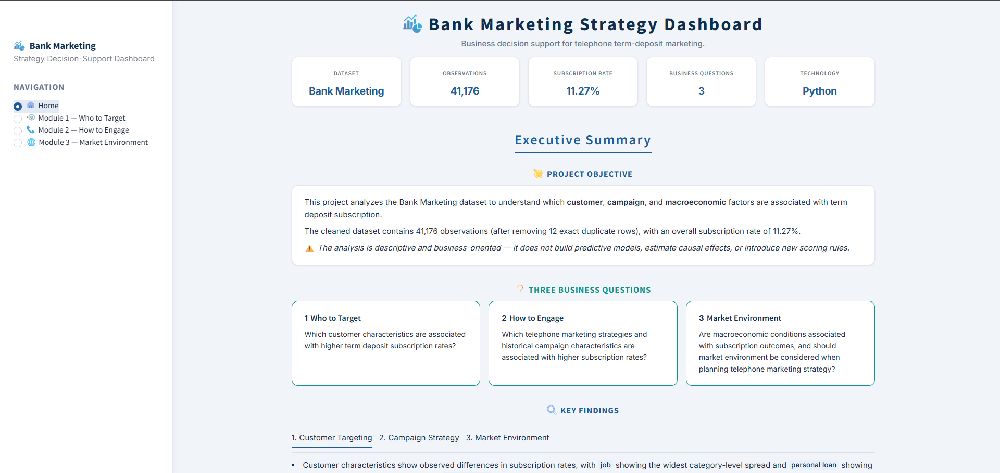
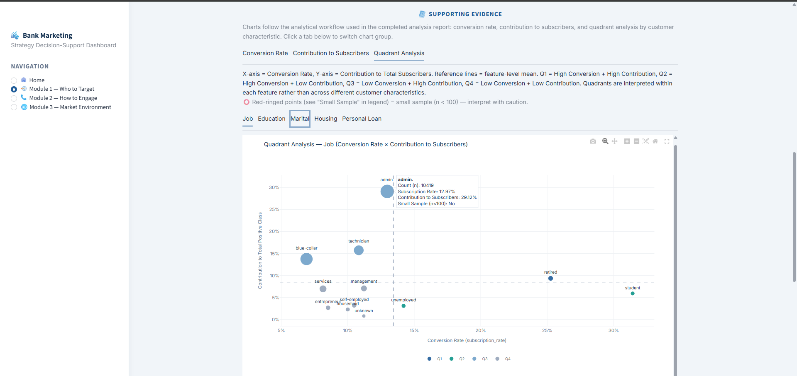
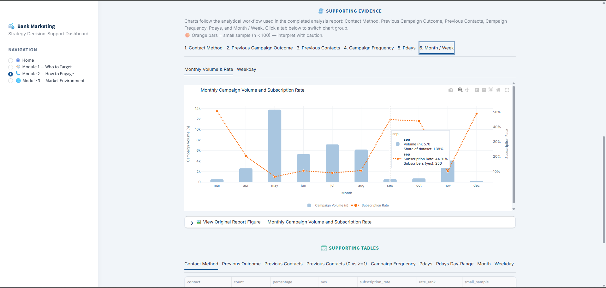
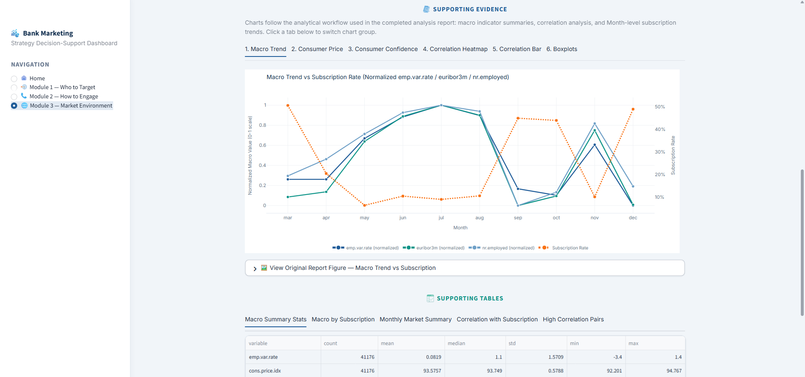

# Bank Marketing Analytics Dashboard

An exploratory business analytics project that examines which customer, campaign, and macroeconomic factors are associated with term deposit subscription, presented through an interactive Streamlit decision-support dashboard.

## Live Demo

[Open Live Demo](https://bank-marketing-analytics-dashboard.streamlit.app/)

---

## Dashboard Preview

### Home



### Module 1 — Who to Target



Customer segmentation combining conversion rate, contribution, and quadrant analysis.

### Module 2 — How to Engage



Campaign strategy evaluation using interactive business visualizations.

### Module 3 — Market Environment



Macroeconomic indicators compared with subscription trends.

---

## Project Overview

This project analyzes the UCI Bank Marketing dataset to identify which **customer**, **campaign**, and **macroeconomic** factors are associated with term deposit subscription.

It is structured around three business questions — who to target, how to engage, and whether market environment should inform strategy — and delivers results through an interactive Streamlit dashboard.

| Item | Value |
|------|-------|
| Dataset | UCI Bank Marketing (`bank-additional-full.csv`) |
| Observations analyzed | 41,176 (after removing 12 exact duplicate rows from 41,188 raw rows) |
| Overall subscription rate | 11.27% (4,639 subscribers) |
| Analysis type | Descriptive / exploratory business analytics |

The analysis is descriptive and business-oriented. It does **not** build predictive models, estimate causal effects, or introduce scoring rules. Findings describe observed associations only.

---

## Business Questions

The dashboard is organized around three modules, consistent with the in-app navigation:

| Module | Theme | Business Question |
|--------|-------|-------------------|
| **Module 1** | Who to Target | Which customer characteristics are associated with higher term deposit subscription rates? |
| **Module 2** | How to Engage | Which telephone marketing strategies and historical campaign characteristics are associated with higher subscription rates? |
| **Module 3** | Market Environment | Are macroeconomic conditions associated with subscription outcomes, and should market environment be considered when planning telephone marketing strategy? |

---

## Project Highlights

- Business-question-driven structure (Who to Target / How to Engage / Market Environment)
- Descriptive analysis with explicit association-vs-causation framing
- Interactive Streamlit dashboard for stakeholder-friendly review
- Executive Summary with KPIs, recommendations, and limitations
- Interpretation notes and small-sample caveats on module pages
- Reproducible analysis scripts alongside presentation-ready reports

---

## Dashboard Features

The dashboard is designed for business review rather than technical exploration:

- **Business-question-driven navigation** across Who to Target, How to Engage, and Market Environment
- **Interactive Plotly visualizations** that surface conversion patterns, segment contribution, and market context
- **Executive Summary** with KPIs, consolidated findings, recommendations, and limitations
- **Business interpretation** on each module — key takeaway, impact notes, and caveats
- **Supporting evidence** through charts and tables aligned with the completed analysis
- **Stakeholder-friendly presentation** of precomputed results without recomputing statistics at runtime

---

## Analysis Workflow

```text
Business Understanding
        ↓
Data Cleaning (exact-duplicate removal only)
        ↓
Exploratory Data Analysis
        ↓
Module Analysis (Customer / Campaign / Market)
        ↓
Business Insights & Interpretation Notes
        ↓
Executive Summary & Recommendations
        ↓
Interactive Streamlit Dashboard
```

1. **Business Understanding** — Frame the three decision-oriented questions above.
2. **Data Cleaning** — Remove 12 exact duplicate rows; no imputation, encoding, or feature engineering.
3. **Exploratory Data Analysis** — Assess structure, quality, target balance, features, interactions, and limitations.
4. **Business Insights** — Produce module-level findings with supporting charts and tables.
5. **Executive Summary** — Consolidate key findings, recommendations, and caveats.
6. **Interactive Dashboard** — Present completed results for non-technical review (no recomputation of statistics).

---

## Key Findings

Summarized from the completed Executive Summary and dashboard content.

### Who to Target (Customer Targeting)

- `job` shows the widest category-level spread in subscription rates; `personal loan` shows the narrowest.
- Notable segments for prioritization discussion include `student`, `retired`, `single`, and `university.degree`, subject to scale and sample-size context.
- Large groups such as `admin.` and `married` contribute many subscribers through volume even when conversion is not the highest.
- Average age differs by only about one year between subscribers and non-subscribers; age alone is not a primary targeting signal.
- Small-sample categories (e.g. `marital=unknown`, `education=illiterate`, `default=yes`) should not drive decisions.

### How to Engage (Campaign Strategy)

- `cellular` contact shows a higher observed subscription rate than `telephone`.
- Lower campaign frequency is associated with better outcomes; one contact ranks highest, while 6+ contacts ranks lowest.
- Prior engagement signals (`previous >= 1`, `pdays != 999`, especially `poutcome = success`) show substantially higher rates than no prior contact.
- Timing should be read with volume: March has the highest rate; May has the largest volume but the lowest rate. Weekday differences are modest.
- Associations only — prior success or channel should not be treated as causal without further analysis.

### Market Environment

- Macro indicators show statistical association with subscription; the largest absolute correlations involve `nr.employed`, then `euribor3m` and `emp.var.rate`.
- `cons.price.idx` is weaker; `cons.conf.idx` is the weakest macro signal in this module.
- Market context is useful when comparing performance across months or conditions, but not as a standalone decision rule.
- Macro variables are intercorrelated and tied to `month`, limiting isolation of any single indicator.
- Co-movement during the campaign period does not imply that macro changes caused subscription behavior.

---

## Technology Stack

| Tool | Role |
|------|------|
| Python | Primary language |
| Pandas | Data loading and tabular analysis |
| NumPy | Numerical support (via scientific stack) |
| Matplotlib | Static chart generation in analysis scripts |
| Seaborn | Statistical visualization in EDA / modules |
| Plotly | Interactive charts in the dashboard |
| Streamlit | Interactive dashboard application |

---

## Repository Structure

```text
.
├── app.py                 # Streamlit entry point
├── requirements.txt       # Runtime dependencies
├── pyproject.toml         # Project metadata (uv)
├── assets/                # README / portfolio screenshots
├── dashboard/             # Dashboard UI, theme, and static content
│   ├── assets/            # In-app icons
│   ├── data/              # Transcribed KPIs and narrative content
│   └── views/             # Home and module pages
├── analysis/              # Reproducible EDA and Module 1–3 scripts
│   ├── main.py            # Full EDA pipeline entry
│   ├── eda/               # Shared EDA package
│   └── module*.py         # Business-module analyses
├── data/                  # Raw Bank Marketing CSV files
├── images/                # Generated charts used by reports and dashboard
├── reports/               # Executive, module, and EDA summaries
└── docs/                  # Additional documentation
```

The dashboard presents precomputed results from the analysis reports. It does not recalculate statistics from the raw CSV at runtime.

---

## How to Run

```bash
# Clone the repository
git clone <repository-url>
cd "Bank Marketing"

# Install dependencies (recommended: uv)
uv sync

# Launch the dashboard (uses the project virtual environment)
uv run streamlit run app.py
```

Alternative with pip (activate your virtual environment first):

```bash
pip install -r requirements.txt
streamlit run app.py
```

Optional — re-run the EDA pipeline (dashboard already uses saved outputs):

```bash
uv run python analysis/main.py
```

---

## Dataset

**Source:** [UCI Bank Marketing Dataset](https://archive.ics.uci.edu/dataset/222/bank+marketing)

Direct marketing campaigns (phone calls) of a Portuguese banking institution. The analysis uses `bank-additional-full.csv`.

| Detail | Description |
|--------|-------------|
| Target variable | `y` — whether the client subscribed to a term deposit (`yes` / `no`) |
| Cleaning applied | 12 exact duplicate rows removed; no other transformation |

---

## Future Improvements

Realistic extensions beyond the current descriptive scope:

- Predictive modeling for subscription propensity (with class-imbalance handling)
- Customer segmentation to complement category-level targeting views
- Model comparison and calibrated ranking for campaign prioritization
- Controlled analysis to separate association from operational drivers
- Deployment of the dashboard (e.g. Streamlit Community Cloud or internal hosting)

---

## License & Attribution

Dataset courtesy of the UCI Machine Learning Repository. Dashboard icons are attributed in the application footer (Flaticon).
