# Module 1 - Customer Profile Analysis: Summary Report

*Business question: Which customer characteristics are associated with a higher subscription rate for term deposits?*

*Data source: `C:\Users\maggie\Desktop\Bank Marketing\bank-additional\bank-additional\bank-additional-full.csv` (raw), cleaned by removing 12 exact duplicate rows -> 41176 observations analyzed.*

## Observation
- Data source (raw file): `C:\Users\maggie\Desktop\Bank Marketing\bank-additional\bank-additional\bank-additional-full.csv`.
- After removing 12 exact duplicate rows (41188 rows before -> 41176 rows after), the cleaned dataset used for this module contains 41176 observations and the 8 columns required for customer profile analysis: ['age', 'job', 'marital', 'education', 'default', 'housing', 'loan', 'y'].
- Overall term deposit subscription rate is 0.1127 (4639 yes / 36537 no out of 41176 observations).
- Age (overall) ranges from 17 to 98 years, with mean=40.02, median=38.0, std=10.42.
- Mean age is 40.91 years for subscribers (y=yes) and 39.91 years for non-subscribers (y=no); the difference between the two means is 1.00 years.
- Categorical variables `default` and `education` contain a valid `unknown` category. This represents a recorded response rather than a missing value and was retained as-is.

## Key Statistics
- Dataset size (cleaned): 41176 observations.
- Class counts: y=no -> 36537; y=yes -> 4639.
- Age quartiles (overall): Q1=32.0, Q2=38.0, Q3=47.0.
- Job: highest subscription rate = `student` (0.3143, n=875); lowest subscription rate = `blue-collar` (0.0690, n=9253); 0 of 12 categories flagged as small sample (n<100).
- Marital status: highest subscription rate = `unknown` (0.1500, n=80, small sample); lowest subscription rate = `married` (0.1016, n=24921); 1 of 4 categories flagged as small sample (n<100).
- Education: highest subscription rate = `illiterate` (0.2222, n=18, small sample); lowest subscription rate = `basic.9y` (0.0782, n=6045); 1 of 8 categories flagged as small sample (n<100).
- Default: highest subscription rate = `no` (0.1288, n=32577); lowest subscription rate = `yes` (0.0000, n=3, small sample); 1 of 3 categories flagged as small sample (n<100).
- Housing loan: highest subscription rate = `yes` (0.1162, n=21571); lowest subscription rate = `unknown` (0.1081, n=990); 0 of 3 categories flagged as small sample (n<100).
- Personal loan: highest subscription rate = `no` (0.1134, n=33938); lowest subscription rate = `unknown` (0.1081, n=990); 0 of 3 categories flagged as small sample (n<100).

## Notable Patterns
- Subscription-rate range across categories is widest for `job` (0.2453 between its highest and lowest category) and narrowest for `loan` (0.0053), indicating `job` shows more variation across categories while `loan` shows comparatively limited differences.
- Categories with sample size below 100 that require cautious interpretation: marital=unknown, education=illiterate, default=yes.
- The mean age difference between subscribers and non-subscribers is 1.00 years, which is small relative to the overall age spread. The full distribution (Figure 1) and boxplot (Figure 2) should be considered rather than relying on the mean alone.
- This module evaluates statistical association between customer characteristics and subscription status only; observed differences do not imply that these characteristics directly influence subscription decisions. Campaign behavior and macroeconomic conditions are analyzed in separate modules to avoid overlapping interpretation.

## Business Summary

*Business question: Which customer characteristics are associated with a higher subscription rate for term deposits?*

### Overall Conclusion
- Customer profile variables show observable association with term deposit subscription rates, with `job` showing the widest category-level subscription-rate spread and `loan` showing the narrowest spread in this module.
- The strongest business-useful customer-profile signals come from combining conversion rate, group size, contribution to the positive class, and quadrant placement rather than relying on conversion rate alone.
- The existing segmentation synthesis identifies 8 high-potential segment(s), 12 high-impact segment(s), and 6 stable segment(s), using only the already-computed EDA tables.
- Age shows only a small mean difference between subscribers and non-subscribers relative to the overall age spread, so customer-profile interpretation should rely more on the categorical patterns and segment synthesis than on age mean alone.

### Business Implications
- High-potential segments can help identify customer categories with above-reference conversion rates and reasonable sample sizes; these are useful for prioritization discussions, not for individual-level prediction.
- High-impact segments highlight large groups that contribute materially to total subscribers; these groups are useful when the business goal is subscriber volume rather than only category-level conversion rate.
- Stable segments provide baseline customer groups whose subscription rates sit close to the overall rate; these are useful for benchmarking and for avoiding overreaction to a single high-rate category.
- Customer-profile findings should be combined with campaign strategy (Module 2) and market context (Module 3) before being used in telephone marketing planning.

### Limitations
- This module is descriptive EDA only: it shows association between customer characteristics and subscription status, but it does not establish causality or produce a targeting model.
- Some categories are flagged as small samples (n < 100), so high or low subscription rates in those groups should not be treated as stable business rules.
- Contribution to the positive class is influenced by group size, while conversion rate is influenced by within-group outcomes; both metrics must be interpreted together.
- The segmentation synthesis is rule-based and reuses existing EDA values only; it should not be treated as a validated scoring framework or prediction workflow.

## Appendix: Supporting Analysis

### Positive Class Contribution Analysis

*Definition: contribution to positive class = (number of y=yes observations within a category) / (total number of y=yes observations in the cleaned dataset). This measures each category's share of all subscribers, which is independent of - and reported alongside, not in place of - its own conversion rate (subscription rate) and group size.*

- Job: `admin.` contributes the largest share of all subscribers (0.2912 of 4639 total y=yes observations, n=10419), while its conversion-rate rank is 4 of 12 (0.1297).
- Marital status: `married` contributes the largest share of all subscribers (0.5456 of 4639 total y=yes observations, n=24921), while its conversion-rate rank is 4 of 4 (0.1016).
- Education: `university.degree` contributes the largest share of all subscribers (0.3598 of 4639 total y=yes observations, n=12164), while its conversion-rate rank is 3 of 8 (0.1372).
- Default: `no` contributes the largest share of all subscribers (0.9045 of 4639 total y=yes observations, n=32577), while its conversion-rate rank is 1 of 3 (0.1288).
- Housing loan: `yes` contributes the largest share of all subscribers (0.5404 of 4639 total y=yes observations, n=21571), while its conversion-rate rank is 1 of 3 (0.1162).
- Personal loan: `no` contributes the largest share of all subscribers (0.8297 of 4639 total y=yes observations, n=33938), while its conversion-rate rank is 1 of 3 (0.1134).

#### Contribution Table - Job

*Sorted by contribution to positive class (descending) - a separate ranking from the conversion-rate ranking in the Appendix tables below. small_sample_flag uses the same n < 100 rule used throughout this report.*

| contribution_rank | job | count | subscription_rate | contribution_to_yes | small_sample_flag |
| --- | --- | --- | --- | --- | --- |
| 1 | admin. | 10419 | 0.1297 | 0.2912 | No |
| 2 | technician | 6739 | 0.1083 | 0.1574 | No |
| 3 | blue-collar | 9253 | 0.0690 | 0.1375 | No |
| 4 | retired | 1718 | 0.2526 | 0.0936 | No |
| 5 | management | 2924 | 0.1122 | 0.0707 | No |
| 6 | services | 3967 | 0.0814 | 0.0696 | No |
| 7 | student | 875 | 0.3143 | 0.0593 | No |
| 8 | self-employed | 1421 | 0.1049 | 0.0321 | No |
| 9 | unemployed | 1014 | 0.1420 | 0.0310 | No |
| 10 | entrepreneur | 1456 | 0.0852 | 0.0267 | No |
| 11 | housemaid | 1060 | 0.1000 | 0.0228 | No |
| 12 | unknown | 330 | 0.1121 | 0.0080 | No |

#### Contribution Table - Marital Status

*Sorted by contribution to positive class (descending) - a separate ranking from the conversion-rate ranking in the Appendix tables below. small_sample_flag uses the same n < 100 rule used throughout this report.*

| contribution_rank | marital | count | subscription_rate | contribution_to_yes | small_sample_flag |
| --- | --- | --- | --- | --- | --- |
| 1 | married | 24921 | 0.1016 | 0.5456 | No |
| 2 | single | 11564 | 0.1401 | 0.3492 | No |
| 3 | divorced | 4611 | 0.1032 | 0.1026 | No |
| 4 | unknown | 80 | 0.1500 | 0.0026 | Yes |

#### Contribution Table - Education

*Sorted by contribution to positive class (descending) - a separate ranking from the conversion-rate ranking in the Appendix tables below. small_sample_flag uses the same n < 100 rule used throughout this report.*

| contribution_rank | education | count | subscription_rate | contribution_to_yes | small_sample_flag |
| --- | --- | --- | --- | --- | --- |
| 1 | university.degree | 12164 | 0.1372 | 0.3598 | No |
| 2 | high.school | 9512 | 0.1084 | 0.2222 | No |
| 3 | professional.course | 5240 | 0.1135 | 0.1283 | No |
| 4 | basic.9y | 6045 | 0.0782 | 0.1020 | No |
| 5 | basic.4y | 4176 | 0.1025 | 0.0923 | No |
| 6 | unknown | 1730 | 0.1451 | 0.0541 | No |
| 7 | basic.6y | 2291 | 0.0821 | 0.0405 | No |
| 8 | illiterate | 18 | 0.2222 | 0.0009 | Yes |

#### Contribution Table - Default

*Sorted by contribution to positive class (descending) - a separate ranking from the conversion-rate ranking in the Appendix tables below. small_sample_flag uses the same n < 100 rule used throughout this report.*

| contribution_rank | default | count | subscription_rate | contribution_to_yes | small_sample_flag |
| --- | --- | --- | --- | --- | --- |
| 1 | no | 32577 | 0.1288 | 0.9045 | No |
| 2 | unknown | 8596 | 0.0515 | 0.0955 | No |
| 3 | yes | 3 | 0.0000 | 0.0000 | Yes |

#### Contribution Table - Housing Loan

*Sorted by contribution to positive class (descending) - a separate ranking from the conversion-rate ranking in the Appendix tables below. small_sample_flag uses the same n < 100 rule used throughout this report.*

| contribution_rank | housing | count | subscription_rate | contribution_to_yes | small_sample_flag |
| --- | --- | --- | --- | --- | --- |
| 1 | yes | 21571 | 0.1162 | 0.5404 | No |
| 2 | no | 18615 | 0.1088 | 0.4365 | No |
| 3 | unknown | 990 | 0.1081 | 0.0231 | No |

#### Contribution Table - Personal Loan

*Sorted by contribution to positive class (descending) - a separate ranking from the conversion-rate ranking in the Appendix tables below. small_sample_flag uses the same n < 100 rule used throughout this report.*

| contribution_rank | loan | count | subscription_rate | contribution_to_yes | small_sample_flag |
| --- | --- | --- | --- | --- | --- |
| 1 | no | 33938 | 0.1134 | 0.8297 | No |
| 2 | yes | 6248 | 0.1093 | 0.1472 | No |
| 3 | unknown | 990 | 0.1081 | 0.0231 | No |

##### Contribution to Positive Class (yes) by Job

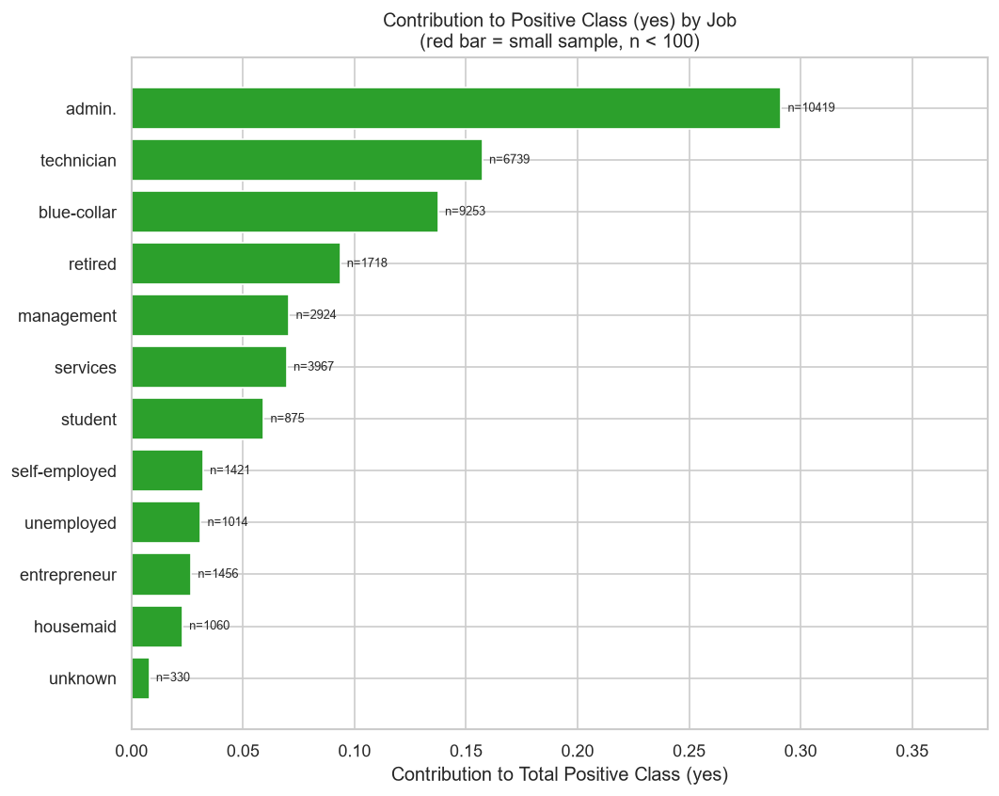

##### Contribution to Positive Class (yes) by Marital Status

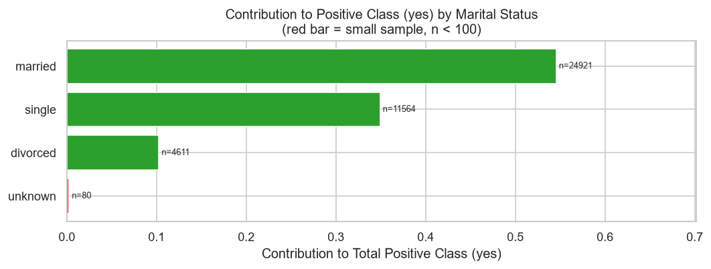

##### Contribution to Positive Class (yes) by Education

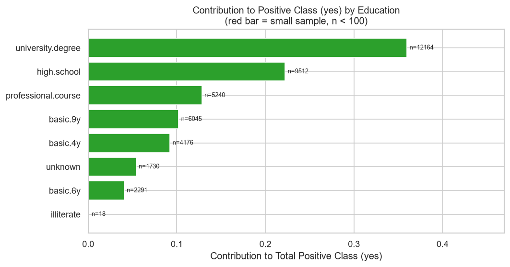

##### Contribution to Positive Class (yes) by Default Status

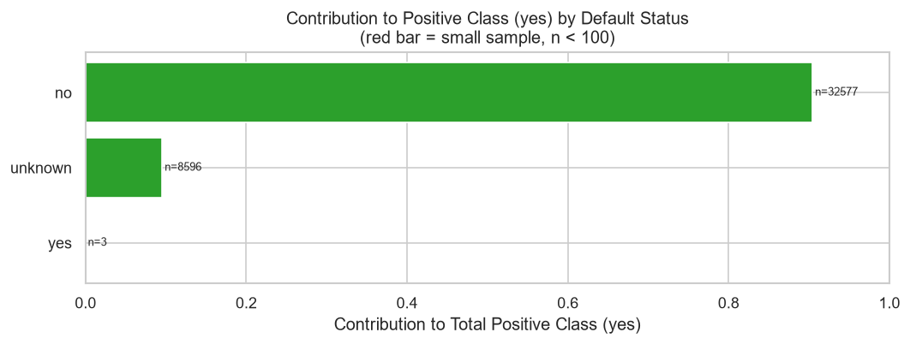

##### Contribution to Positive Class (yes) by Housing Loan

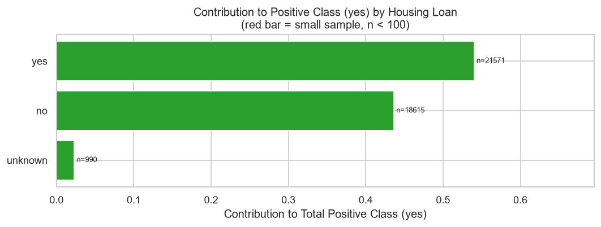

##### Contribution to Positive Class (yes) by Personal Loan

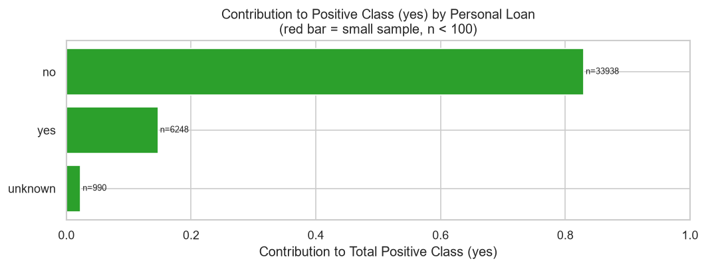

### Quadrant Analysis Observations

*Quadrant segmentation for job, education, marital, housing, and loan. X-axis = Conversion Rate (subscription_rate); Y-axis = Contribution to Total Positive Class (contribution_to_yes). Reference lines = mean of each axis across that feature's own categories. Q1 = High Conversion + High Contribution; Q2 = High Conversion + Low Contribution; Q3 = Low Conversion + High Contribution; Q4 = Low Conversion + Low Contribution. Statements below list category membership and observed values only; they do not infer cause or predict future behavior.*

- **Job** (reference lines: mean conversion rate = 0.1343, mean contribution to positive class = 0.0833):
  - Q1: High Conversion + High Contribution: `retired` (rate=0.2526, contribution=0.0936, n=1718).
  - Q2: High Conversion + Low Contribution: `student` (rate=0.3143, contribution=0.0593, n=875), `unemployed` (rate=0.1420, contribution=0.0310, n=1014).
  - Q3: Low Conversion + High Contribution: `admin.` (rate=0.1297, contribution=0.2912, n=10419), `technician` (rate=0.1083, contribution=0.1574, n=6739), `blue-collar` (rate=0.0690, contribution=0.1375, n=9253).
  - Q4: Low Conversion + Low Contribution: `management` (rate=0.1122, contribution=0.0707, n=2924), `unknown` (rate=0.1121, contribution=0.0080, n=330), `self-employed` (rate=0.1049, contribution=0.0321, n=1421), `housemaid` (rate=0.1000, contribution=0.0228, n=1060), `entrepreneur` (rate=0.0852, contribution=0.0267, n=1456), `services` (rate=0.0814, contribution=0.0696, n=3967).
- **Education** (reference lines: mean conversion rate = 0.1237, mean contribution to positive class = 0.1250):
  - Q1: High Conversion + High Contribution: `university.degree` (rate=0.1372, contribution=0.3598, n=12164).
  - Q2: High Conversion + Low Contribution: `illiterate` (rate=0.2222, contribution=0.0009, n=18, small sample), `unknown` (rate=0.1451, contribution=0.0541, n=1730).
  - Q3: Low Conversion + High Contribution: `professional.course` (rate=0.1135, contribution=0.1283, n=5240), `high.school` (rate=0.1084, contribution=0.2222, n=9512).
  - Q4: Low Conversion + Low Contribution: `basic.4y` (rate=0.1025, contribution=0.0923, n=4176), `basic.6y` (rate=0.0821, contribution=0.0405, n=2291), `basic.9y` (rate=0.0782, contribution=0.1020, n=6045).
- **Marital Status** (reference lines: mean conversion rate = 0.1237, mean contribution to positive class = 0.2500):
  - Q1: High Conversion + High Contribution: `single` (rate=0.1401, contribution=0.3492, n=11564).
  - Q2: High Conversion + Low Contribution: `unknown` (rate=0.1500, contribution=0.0026, n=80, small sample).
  - Q3: Low Conversion + High Contribution: `married` (rate=0.1016, contribution=0.5456, n=24921).
  - Q4: Low Conversion + Low Contribution: `divorced` (rate=0.1032, contribution=0.1026, n=4611).
- **Housing Loan** (reference lines: mean conversion rate = 0.1110, mean contribution to positive class = 0.3333):
  - Q1: High Conversion + High Contribution: `yes` (rate=0.1162, contribution=0.5404, n=21571).
  - Q2: High Conversion + Low Contribution: none.
  - Q3: Low Conversion + High Contribution: `no` (rate=0.1088, contribution=0.4365, n=18615).
  - Q4: Low Conversion + Low Contribution: `unknown` (rate=0.1081, contribution=0.0231, n=990).
- **Personal Loan** (reference lines: mean conversion rate = 0.1103, mean contribution to positive class = 0.3333):
  - Q1: High Conversion + High Contribution: `no` (rate=0.1134, contribution=0.8297, n=33938).
  - Q2: High Conversion + Low Contribution: none.
  - Q3: Low Conversion + High Contribution: none.
  - Q4: Low Conversion + Low Contribution: `yes` (rate=0.1093, contribution=0.1472, n=6248), `unknown` (rate=0.1081, contribution=0.0231, n=990).

#### Quadrant Table - Job

*Reused conversion rate and contribution values from the tables above (not recalculated); sorted by conversion rate (descending). small_sample_flag uses the same n < 100 rule used throughout this report.*

| job | count | subscription_rate | contribution_to_yes | small_sample_flag | quadrant |
| --- | --- | --- | --- | --- | --- |
| student | 875 | 0.3143 | 0.0593 | No | Q2: High Conversion + Low Contribution |
| retired | 1718 | 0.2526 | 0.0936 | No | Q1: High Conversion + High Contribution |
| unemployed | 1014 | 0.1420 | 0.0310 | No | Q2: High Conversion + Low Contribution |
| admin. | 10419 | 0.1297 | 0.2912 | No | Q3: Low Conversion + High Contribution |
| management | 2924 | 0.1122 | 0.0707 | No | Q4: Low Conversion + Low Contribution |
| unknown | 330 | 0.1121 | 0.0080 | No | Q4: Low Conversion + Low Contribution |
| technician | 6739 | 0.1083 | 0.1574 | No | Q3: Low Conversion + High Contribution |
| self-employed | 1421 | 0.1049 | 0.0321 | No | Q4: Low Conversion + Low Contribution |
| housemaid | 1060 | 0.1000 | 0.0228 | No | Q4: Low Conversion + Low Contribution |
| entrepreneur | 1456 | 0.0852 | 0.0267 | No | Q4: Low Conversion + Low Contribution |
| services | 3967 | 0.0814 | 0.0696 | No | Q4: Low Conversion + Low Contribution |
| blue-collar | 9253 | 0.0690 | 0.1375 | No | Q3: Low Conversion + High Contribution |

#### Quadrant Table - Education

*Reused conversion rate and contribution values from the tables above (not recalculated); sorted by conversion rate (descending). small_sample_flag uses the same n < 100 rule used throughout this report.*

| education | count | subscription_rate | contribution_to_yes | small_sample_flag | quadrant |
| --- | --- | --- | --- | --- | --- |
| illiterate | 18 | 0.2222 | 0.0009 | Yes | Q2: High Conversion + Low Contribution |
| unknown | 1730 | 0.1451 | 0.0541 | No | Q2: High Conversion + Low Contribution |
| university.degree | 12164 | 0.1372 | 0.3598 | No | Q1: High Conversion + High Contribution |
| professional.course | 5240 | 0.1135 | 0.1283 | No | Q3: Low Conversion + High Contribution |
| high.school | 9512 | 0.1084 | 0.2222 | No | Q3: Low Conversion + High Contribution |
| basic.4y | 4176 | 0.1025 | 0.0923 | No | Q4: Low Conversion + Low Contribution |
| basic.6y | 2291 | 0.0821 | 0.0405 | No | Q4: Low Conversion + Low Contribution |
| basic.9y | 6045 | 0.0782 | 0.1020 | No | Q4: Low Conversion + Low Contribution |

#### Quadrant Table - Marital Status

*Reused conversion rate and contribution values from the tables above (not recalculated); sorted by conversion rate (descending). small_sample_flag uses the same n < 100 rule used throughout this report.*

| marital | count | subscription_rate | contribution_to_yes | small_sample_flag | quadrant |
| --- | --- | --- | --- | --- | --- |
| unknown | 80 | 0.1500 | 0.0026 | Yes | Q2: High Conversion + Low Contribution |
| single | 11564 | 0.1401 | 0.3492 | No | Q1: High Conversion + High Contribution |
| divorced | 4611 | 0.1032 | 0.1026 | No | Q4: Low Conversion + Low Contribution |
| married | 24921 | 0.1016 | 0.5456 | No | Q3: Low Conversion + High Contribution |

#### Quadrant Table - Housing Loan

*Reused conversion rate and contribution values from the tables above (not recalculated); sorted by conversion rate (descending). small_sample_flag uses the same n < 100 rule used throughout this report.*

| housing | count | subscription_rate | contribution_to_yes | small_sample_flag | quadrant |
| --- | --- | --- | --- | --- | --- |
| yes | 21571 | 0.1162 | 0.5404 | No | Q1: High Conversion + High Contribution |
| no | 18615 | 0.1088 | 0.4365 | No | Q3: Low Conversion + High Contribution |
| unknown | 990 | 0.1081 | 0.0231 | No | Q4: Low Conversion + Low Contribution |

#### Quadrant Table - Personal Loan

*Reused conversion rate and contribution values from the tables above (not recalculated); sorted by conversion rate (descending). small_sample_flag uses the same n < 100 rule used throughout this report.*

| loan | count | subscription_rate | contribution_to_yes | small_sample_flag | quadrant |
| --- | --- | --- | --- | --- | --- |
| no | 33938 | 0.1134 | 0.8297 | No | Q1: High Conversion + High Contribution |
| yes | 6248 | 0.1093 | 0.1472 | No | Q4: Low Conversion + Low Contribution |
| unknown | 990 | 0.1081 | 0.0231 | No | Q4: Low Conversion + Low Contribution |

##### Quadrant Analysis - Job

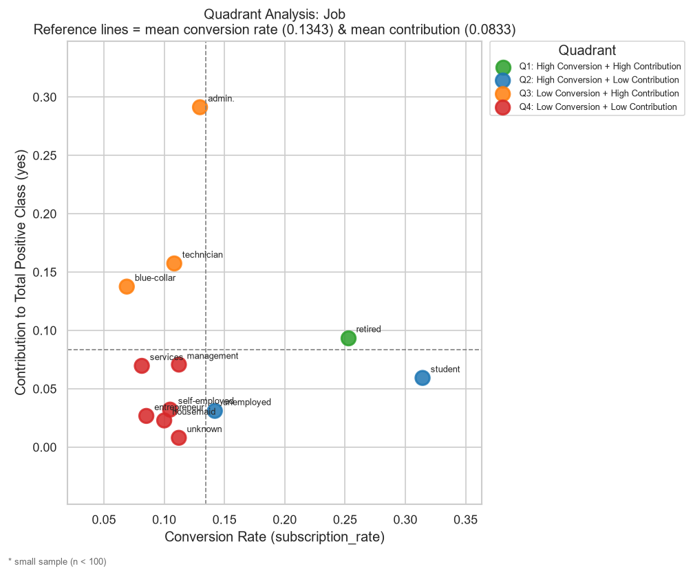

##### Quadrant Analysis - Education

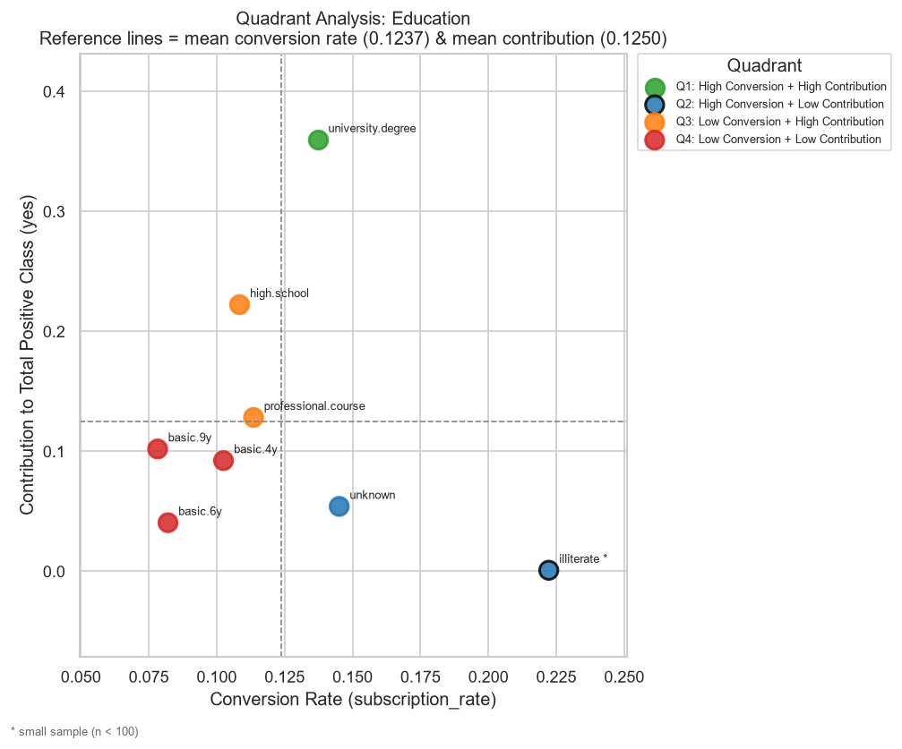

##### Quadrant Analysis - Marital Status

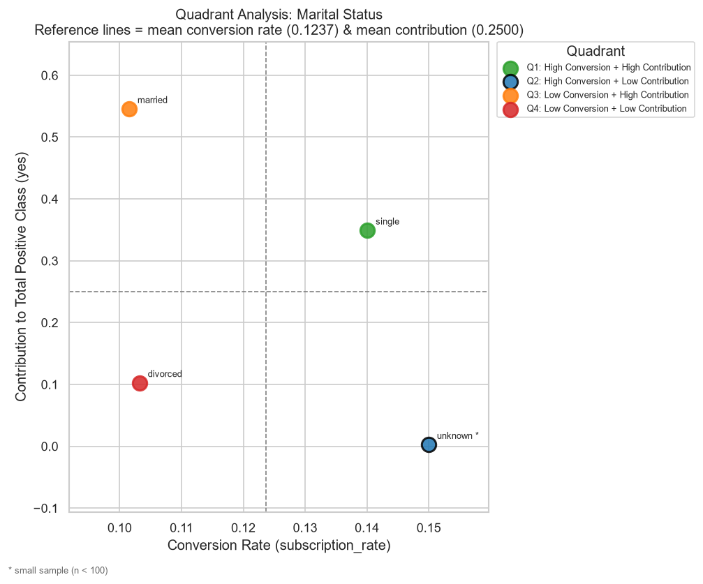

##### Quadrant Analysis - Housing Loan

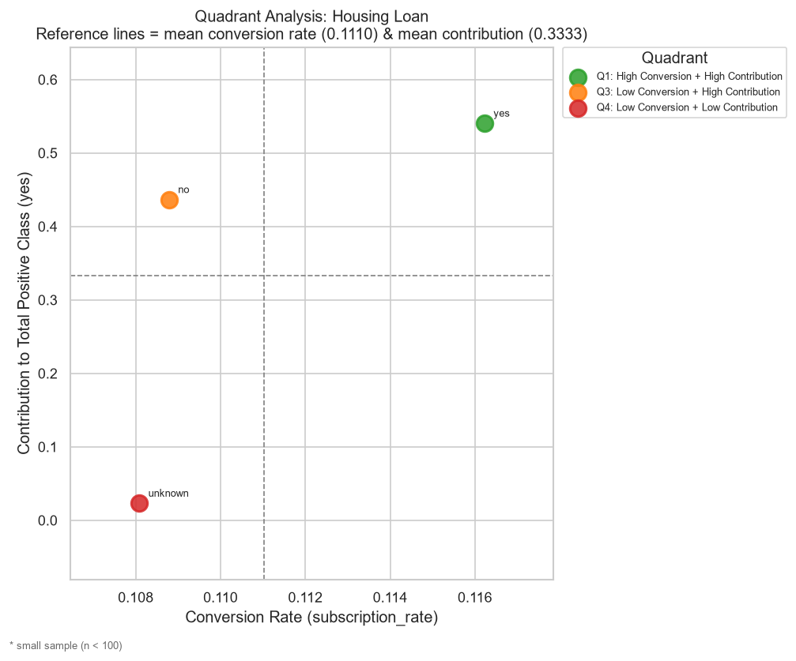

##### Quadrant Analysis - Personal Loan

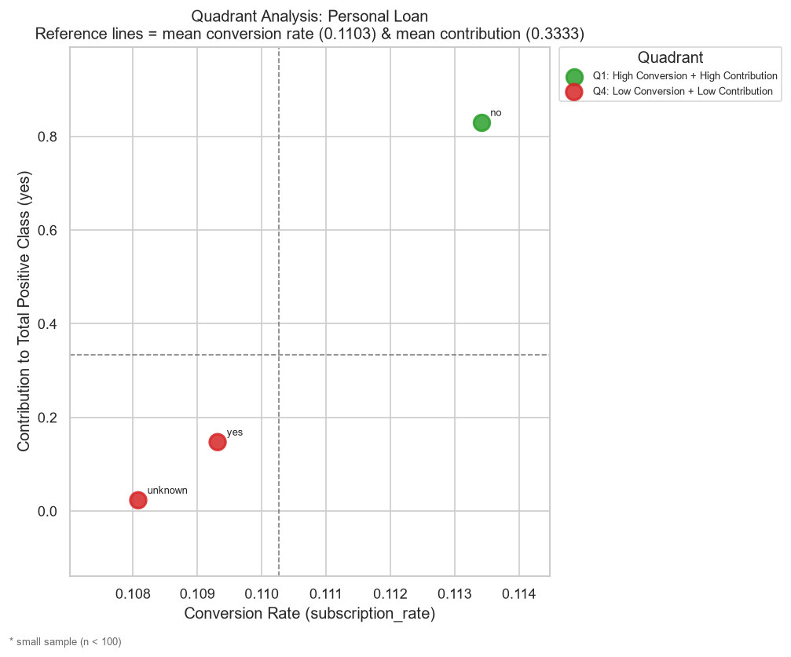

### Segmentation Synthesis Details

*This section synthesizes the results already computed above (conversion rate, group size, contribution to positive class, and quadrant analysis) into three segment types. No EDA metric is recalculated, no new groupby is performed, and no ML / prediction / scoring is used - this is a rule-based synthesis of existing values only.*

#### 1. High-Potential Segments

*Rule: quadrant Q1 or Q2 (conversion rate at/above the feature's own mean) AND a reasonable sample size (count >= 100, i.e. not small_sample_flag). High conversion + reasonable sample; Q1/Q2 = high conversion rate side of the quadrant analysis above.*

| feature | category | count | subscription_rate | contribution_to_yes | quadrant |
| --- | --- | --- | --- | --- | --- |
| Job | student | 875 | 0.3143 | 0.0593 | Q2: High Conversion + Low Contribution |
| Job | retired | 1718 | 0.2526 | 0.0936 | Q1: High Conversion + High Contribution |
| Education | unknown | 1730 | 0.1451 | 0.0541 | Q2: High Conversion + Low Contribution |
| Job | unemployed | 1014 | 0.1420 | 0.0310 | Q2: High Conversion + Low Contribution |
| Marital Status | single | 11564 | 0.1401 | 0.3492 | Q1: High Conversion + High Contribution |
| Education | university.degree | 12164 | 0.1372 | 0.3598 | Q1: High Conversion + High Contribution |
| Housing Loan | yes | 21571 | 0.1162 | 0.5404 | Q1: High Conversion + High Contribution |
| Personal Loan | no | 33938 | 0.1134 | 0.8297 | Q1: High Conversion + High Contribution |

- **Job = `student`**
  - why included: Conversion rate 0.3143 is at/above the Job feature mean (0.1343) [Q2: High Conversion + Low Contribution], with sample size n=875 at/above the small-sample threshold (n<100).
  - stability: High conversion rate only; contribution to total subscribers is below this feature's mean (Q2: aligned on one axis only).
  - risk: Represents 2.13% of all cleaned observations; subject to the dataset-wide class imbalance (overall yes rate = 0.1127).
- **Job = `retired`**
  - why included: Conversion rate 0.2526 is at/above the Job feature mean (0.1343) [Q1: High Conversion + High Contribution], with sample size n=1718 at/above the small-sample threshold (n<100).
  - stability: Reinforced by both high conversion rate and high contribution (Q1: aligned on both axes).
  - risk: Represents 4.17% of all cleaned observations; subject to the dataset-wide class imbalance (overall yes rate = 0.1127).
- **Education = `unknown`**
  - why included: Conversion rate 0.1451 is at/above the Education feature mean (0.1237) [Q2: High Conversion + Low Contribution], with sample size n=1730 at/above the small-sample threshold (n<100).
  - stability: High conversion rate only; contribution to total subscribers is below this feature's mean (Q2: aligned on one axis only).
  - risk: Represents 4.20% of all cleaned observations; subject to the dataset-wide class imbalance (overall yes rate = 0.1127).
- **Job = `unemployed`**
  - why included: Conversion rate 0.1420 is at/above the Job feature mean (0.1343) [Q2: High Conversion + Low Contribution], with sample size n=1014 at/above the small-sample threshold (n<100).
  - stability: High conversion rate only; contribution to total subscribers is below this feature's mean (Q2: aligned on one axis only).
  - risk: Represents 2.46% of all cleaned observations; subject to the dataset-wide class imbalance (overall yes rate = 0.1127).
- **Marital Status = `single`**
  - why included: Conversion rate 0.1401 is at/above the Marital Status feature mean (0.1237) [Q1: High Conversion + High Contribution], with sample size n=11564 at/above the small-sample threshold (n<100).
  - stability: Reinforced by both high conversion rate and high contribution (Q1: aligned on both axes).
  - risk: Represents 28.08% of all cleaned observations; subject to the dataset-wide class imbalance (overall yes rate = 0.1127).
- **Education = `university.degree`**
  - why included: Conversion rate 0.1372 is at/above the Education feature mean (0.1237) [Q1: High Conversion + High Contribution], with sample size n=12164 at/above the small-sample threshold (n<100).
  - stability: Reinforced by both high conversion rate and high contribution (Q1: aligned on both axes).
  - risk: Represents 29.54% of all cleaned observations; subject to the dataset-wide class imbalance (overall yes rate = 0.1127).
- **Housing Loan = `yes`**
  - why included: Conversion rate 0.1162 is at/above the Housing Loan feature mean (0.1110) [Q1: High Conversion + High Contribution], with sample size n=21571 at/above the small-sample threshold (n<100).
  - stability: Reinforced by both high conversion rate and high contribution (Q1: aligned on both axes).
  - risk: Represents 52.39% of all cleaned observations; subject to the dataset-wide class imbalance (overall yes rate = 0.1127).
- **Personal Loan = `no`**
  - why included: Conversion rate 0.1134 is at/above the Personal Loan feature mean (0.1103) [Q1: High Conversion + High Contribution], with sample size n=33938 at/above the small-sample threshold (n<100).
  - stability: Reinforced by both high conversion rate and high contribution (Q1: aligned on both axes).
  - risk: Represents 82.42% of all cleaned observations; subject to the dataset-wide class imbalance (overall yes rate = 0.1127).

#### 2. High-Impact Segments

*Rule: top 2 contributor(s) to total subscribers (contribution_rank <= 2) within each feature AND a large sample size (count >= 100, i.e. not small_sample_flag).*

| feature | category | count | contribution_to_yes | contribution_rank | subscription_rate |
| --- | --- | --- | --- | --- | --- |
| Default | no | 32577 | 0.9045 | 1 | 0.1288 |
| Personal Loan | no | 33938 | 0.8297 | 1 | 0.1134 |
| Marital Status | married | 24921 | 0.5456 | 1 | 0.1016 |
| Housing Loan | yes | 21571 | 0.5404 | 1 | 0.1162 |
| Housing Loan | no | 18615 | 0.4365 | 2 | 0.1088 |
| Education | university.degree | 12164 | 0.3598 | 1 | 0.1372 |
| Marital Status | single | 11564 | 0.3492 | 2 | 0.1401 |
| Job | admin. | 10419 | 0.2912 | 1 | 0.1297 |
| Education | high.school | 9512 | 0.2222 | 2 | 0.1084 |
| Job | technician | 6739 | 0.1574 | 2 | 0.1083 |
| Personal Loan | yes | 6248 | 0.1472 | 2 | 0.1093 |
| Default | unknown | 8596 | 0.0955 | 2 | 0.0515 |

- **Default = `no`**
  - why included: Ranked #1 of 3 categories by contribution to total subscribers (0.9045 of all y=yes), backed by a large sample (n=32577).
  - stability: Large group size (n=32577) means this contribution share is based on a substantial sample rather than a handful of observations.
  - risk: None specific beyond the dataset-wide class imbalance.
- **Personal Loan = `no`**
  - why included: Ranked #1 of 3 categories by contribution to total subscribers (0.8297 of all y=yes), backed by a large sample (n=33938).
  - stability: Large group size (n=33938) means this contribution share is based on a substantial sample rather than a handful of observations.
  - risk: None specific beyond the dataset-wide class imbalance.
- **Marital Status = `married`**
  - why included: Ranked #1 of 4 categories by contribution to total subscribers (0.5456 of all y=yes), backed by a large sample (n=24921).
  - stability: Large group size (n=24921) means this contribution share is based on a substantial sample rather than a handful of observations.
  - risk: Conversion rate (0.1016) is below the overall baseline (0.1127); this segment's impact comes mainly from group size rather than conversion efficiency.
- **Housing Loan = `yes`**
  - why included: Ranked #1 of 3 categories by contribution to total subscribers (0.5404 of all y=yes), backed by a large sample (n=21571).
  - stability: Large group size (n=21571) means this contribution share is based on a substantial sample rather than a handful of observations.
  - risk: None specific beyond the dataset-wide class imbalance.
- **Housing Loan = `no`**
  - why included: Ranked #2 of 3 categories by contribution to total subscribers (0.4365 of all y=yes), backed by a large sample (n=18615).
  - stability: Large group size (n=18615) means this contribution share is based on a substantial sample rather than a handful of observations.
  - risk: Conversion rate (0.1088) is below the overall baseline (0.1127); this segment's impact comes mainly from group size rather than conversion efficiency.
- **Education = `university.degree`**
  - why included: Ranked #1 of 8 categories by contribution to total subscribers (0.3598 of all y=yes), backed by a large sample (n=12164).
  - stability: Large group size (n=12164) means this contribution share is based on a substantial sample rather than a handful of observations.
  - risk: None specific beyond the dataset-wide class imbalance.
- **Marital Status = `single`**
  - why included: Ranked #2 of 4 categories by contribution to total subscribers (0.3492 of all y=yes), backed by a large sample (n=11564).
  - stability: Large group size (n=11564) means this contribution share is based on a substantial sample rather than a handful of observations.
  - risk: None specific beyond the dataset-wide class imbalance.
- **Job = `admin.`**
  - why included: Ranked #1 of 12 categories by contribution to total subscribers (0.2912 of all y=yes), backed by a large sample (n=10419).
  - stability: Large group size (n=10419) means this contribution share is based on a substantial sample rather than a handful of observations.
  - risk: None specific beyond the dataset-wide class imbalance.
- **Education = `high.school`**
  - why included: Ranked #2 of 8 categories by contribution to total subscribers (0.2222 of all y=yes), backed by a large sample (n=9512).
  - stability: Large group size (n=9512) means this contribution share is based on a substantial sample rather than a handful of observations.
  - risk: Conversion rate (0.1084) is below the overall baseline (0.1127); this segment's impact comes mainly from group size rather than conversion efficiency.
- **Job = `technician`**
  - why included: Ranked #2 of 12 categories by contribution to total subscribers (0.1574 of all y=yes), backed by a large sample (n=6739).
  - stability: Large group size (n=6739) means this contribution share is based on a substantial sample rather than a handful of observations.
  - risk: Conversion rate (0.1083) is below the overall baseline (0.1127); this segment's impact comes mainly from group size rather than conversion efficiency.
- **Personal Loan = `yes`**
  - why included: Ranked #2 of 3 categories by contribution to total subscribers (0.1472 of all y=yes), backed by a large sample (n=6248).
  - stability: Large group size (n=6248) means this contribution share is based on a substantial sample rather than a handful of observations.
  - risk: Conversion rate (0.1093) is below the overall baseline (0.1127); this segment's impact comes mainly from group size rather than conversion efficiency.
- **Default = `unknown`**
  - why included: Ranked #2 of 3 categories by contribution to total subscribers (0.0955 of all y=yes), backed by a large sample (n=8596).
  - stability: Large group size (n=8596) means this contribution share is based on a substantial sample rather than a handful of observations.
  - risk: Conversion rate (0.0515) is below the overall baseline (0.1127); this segment's impact comes mainly from group size rather than conversion efficiency.

#### 3. Stable Segments

*Rule: the majority (largest-count) category within a feature whose conversion rate is within 0.03 of the overall baseline rate (0.1127) - checked across all 6 categorical features so the pattern is not tied to a single variable.*

| feature | category | count | percentage | subscription_rate | diff_from_overall_rate |
| --- | --- | --- | --- | --- | --- |
| loan | no | 33938 | 82.4218 | 0.1134 | 0.0007 |
| housing | yes | 21571 | 52.3873 | 0.1162 | 0.0036 |
| marital | married | 24921 | 60.5231 | 0.1016 | 0.0111 |
| default | no | 32577 | 79.1165 | 0.1288 | 0.0161 |
| job | admin. | 10419 | 25.3036 | 0.1297 | 0.0170 |
| education | university.degree | 12164 | 29.5415 | 0.1372 | 0.0245 |

- **loan = `no`**
  - why included: Largest category in `loan` (n=33938, 82.42% of observations) with conversion rate 0.1134, within 0.03 of the overall baseline rate (0.1127).
  - stability: This near-baseline, majority-category pattern recurs in 6 of 6 categorical features analyzed, indicating it is not dependent on any single variable.
  - risk: Low sample-size risk given majority status; residual risk is the dataset-wide class imbalance (overall yes rate = 0.1127) rather than small-sample noise.
- **housing = `yes`**
  - why included: Largest category in `housing` (n=21571, 52.39% of observations) with conversion rate 0.1162, within 0.03 of the overall baseline rate (0.1127).
  - stability: This near-baseline, majority-category pattern recurs in 6 of 6 categorical features analyzed, indicating it is not dependent on any single variable.
  - risk: Low sample-size risk given majority status; residual risk is the dataset-wide class imbalance (overall yes rate = 0.1127) rather than small-sample noise.
- **marital = `married`**
  - why included: Largest category in `marital` (n=24921, 60.52% of observations) with conversion rate 0.1016, within 0.03 of the overall baseline rate (0.1127).
  - stability: This near-baseline, majority-category pattern recurs in 6 of 6 categorical features analyzed, indicating it is not dependent on any single variable.
  - risk: Low sample-size risk given majority status; residual risk is the dataset-wide class imbalance (overall yes rate = 0.1127) rather than small-sample noise.
- **default = `no`**
  - why included: Largest category in `default` (n=32577, 79.12% of observations) with conversion rate 0.1288, within 0.03 of the overall baseline rate (0.1127).
  - stability: This near-baseline, majority-category pattern recurs in 6 of 6 categorical features analyzed, indicating it is not dependent on any single variable.
  - risk: Low sample-size risk given majority status; residual risk is the dataset-wide class imbalance (overall yes rate = 0.1127) rather than small-sample noise.
- **job = `admin.`**
  - why included: Largest category in `job` (n=10419, 25.30% of observations) with conversion rate 0.1297, within 0.03 of the overall baseline rate (0.1127).
  - stability: This near-baseline, majority-category pattern recurs in 6 of 6 categorical features analyzed, indicating it is not dependent on any single variable.
  - risk: Low sample-size risk given majority status; residual risk is the dataset-wide class imbalance (overall yes rate = 0.1127) rather than small-sample noise.
- **education = `university.degree`**
  - why included: Largest category in `education` (n=12164, 29.54% of observations) with conversion rate 0.1372, within 0.03 of the overall baseline rate (0.1127).
  - stability: This near-baseline, majority-category pattern recurs in 6 of 6 categorical features analyzed, indicating it is not dependent on any single variable.
  - risk: Low sample-size risk given majority status; residual risk is the dataset-wide class imbalance (overall yes rate = 0.1127) rather than small-sample noise.

## Appendix: Data Tables

### Table 1 - Dataset Summary

| observations | subscribed_yes | subscribed_no | subscription_rate |
| --- | --- | --- | --- |
| 41176 | 4639 | 36537 | 0.1127 |

### Table 2 - Age Summary Statistics (Overall / Yes / No)

| index | count | mean | median | std | min | 25% | 50% | 75% | max |
| --- | --- | --- | --- | --- | --- | --- | --- | --- | --- |
| overall | 41176.0000 | 40.0238 | 38.0000 | 10.4207 | 17.0000 | 32.0000 | 38.0000 | 47.0000 | 98.0000 |
| yes | 4639.0000 | 40.9123 | 37.0000 | 13.8388 | 17.0000 | 31.0000 | 37.0000 | 50.0000 | 98.0000 |
| no | 36537.0000 | 39.9110 | 38.0000 | 9.8972 | 17.0000 | 32.0000 | 38.0000 | 47.0000 | 95.0000 |

### Table 3 - Job Subscription Summary

*Sorted by subscription rate (descending). Categories with count < 100 are flagged `small_sample_flag = Yes` and should be interpreted with caution.*

| rank | job | count | percentage | yes | subscription_rate | contribution_to_yes | small_sample_flag |
| --- | --- | --- | --- | --- | --- | --- | --- |
| 1 | student | 875 | 2.1250 | 275 | 0.3143 | 0.0593 | No |
| 2 | retired | 1718 | 4.1723 | 434 | 0.2526 | 0.0936 | No |
| 3 | unemployed | 1014 | 2.4626 | 144 | 0.1420 | 0.0310 | No |
| 4 | admin. | 10419 | 25.3036 | 1351 | 0.1297 | 0.2912 | No |
| 5 | management | 2924 | 7.1012 | 328 | 0.1122 | 0.0707 | No |
| 6 | unknown | 330 | 0.8014 | 37 | 0.1121 | 0.0080 | No |
| 7 | technician | 6739 | 16.3663 | 730 | 0.1083 | 0.1574 | No |
| 8 | self-employed | 1421 | 3.4510 | 149 | 0.1049 | 0.0321 | No |
| 9 | housemaid | 1060 | 2.5743 | 106 | 0.1000 | 0.0228 | No |
| 10 | entrepreneur | 1456 | 3.5360 | 124 | 0.0852 | 0.0267 | No |
| 11 | services | 3967 | 9.6343 | 323 | 0.0814 | 0.0696 | No |
| 12 | blue-collar | 9253 | 22.4718 | 638 | 0.0690 | 0.1375 | No |

### Table 4 - Marital Subscription Summary

*Sorted by subscription rate (descending). Categories with count < 100 are flagged `small_sample_flag = Yes` and should be interpreted with caution.*

| rank | marital | count | percentage | yes | subscription_rate | contribution_to_yes | small_sample_flag |
| --- | --- | --- | --- | --- | --- | --- | --- |
| 1 | unknown | 80 | 0.1943 | 12 | 0.1500 | 0.0026 | Yes |
| 2 | single | 11564 | 28.0843 | 1620 | 0.1401 | 0.3492 | No |
| 3 | divorced | 4611 | 11.1983 | 476 | 0.1032 | 0.1026 | No |
| 4 | married | 24921 | 60.5231 | 2531 | 0.1016 | 0.5456 | No |

### Table 5 - Education Subscription Summary

*Sorted by subscription rate (descending). Categories with count < 100 are flagged `small_sample_flag = Yes` and should be interpreted with caution.*

| rank | education | count | percentage | yes | subscription_rate | contribution_to_yes | small_sample_flag |
| --- | --- | --- | --- | --- | --- | --- | --- |
| 1 | illiterate | 18 | 0.0437 | 4 | 0.2222 | 0.0009 | Yes |
| 2 | unknown | 1730 | 4.2015 | 251 | 0.1451 | 0.0541 | No |
| 3 | university.degree | 12164 | 29.5415 | 1669 | 0.1372 | 0.3598 | No |
| 4 | professional.course | 5240 | 12.7259 | 595 | 0.1135 | 0.1283 | No |
| 5 | high.school | 9512 | 23.1008 | 1031 | 0.1084 | 0.2222 | No |
| 6 | basic.4y | 4176 | 10.1418 | 428 | 0.1025 | 0.0923 | No |
| 7 | basic.6y | 2291 | 5.5639 | 188 | 0.0821 | 0.0405 | No |
| 8 | basic.9y | 6045 | 14.6809 | 473 | 0.0782 | 0.1020 | No |

### Table 6 - Default Subscription Summary

*Sorted by subscription rate (descending). Categories with count < 100 are flagged `small_sample_flag = Yes` and should be interpreted with caution.*

| rank | default | count | percentage | yes | subscription_rate | contribution_to_yes | small_sample_flag |
| --- | --- | --- | --- | --- | --- | --- | --- |
| 1 | no | 32577 | 79.1165 | 4196 | 0.1288 | 0.9045 | No |
| 2 | unknown | 8596 | 20.8762 | 443 | 0.0515 | 0.0955 | No |
| 3 | yes | 3 | 0.0073 | 0 | 0.0000 | 0.0000 | Yes |

### Table 7 - Housing Loan Subscription Summary

*Sorted by subscription rate (descending). Categories with count < 100 are flagged `small_sample_flag = Yes` and should be interpreted with caution.*

| rank | housing | count | percentage | yes | subscription_rate | contribution_to_yes | small_sample_flag |
| --- | --- | --- | --- | --- | --- | --- | --- |
| 1 | yes | 21571 | 52.3873 | 2507 | 0.1162 | 0.5404 | No |
| 2 | no | 18615 | 45.2084 | 2025 | 0.1088 | 0.4365 | No |
| 3 | unknown | 990 | 2.4043 | 107 | 0.1081 | 0.0231 | No |

### Table 8 - Personal Loan Subscription Summary

*Sorted by subscription rate (descending). Categories with count < 100 are flagged `small_sample_flag = Yes` and should be interpreted with caution.*

| rank | loan | count | percentage | yes | subscription_rate | contribution_to_yes | small_sample_flag |
| --- | --- | --- | --- | --- | --- | --- | --- |
| 1 | no | 33938 | 82.4218 | 3849 | 0.1134 | 0.8297 | No |
| 2 | yes | 6248 | 15.1739 | 683 | 0.1093 | 0.1472 | No |
| 3 | unknown | 990 | 2.4043 | 107 | 0.1081 | 0.0231 | No |

## Figures

### Figure 1 - Age Distribution Histogram (Overall & by Subscription Status)

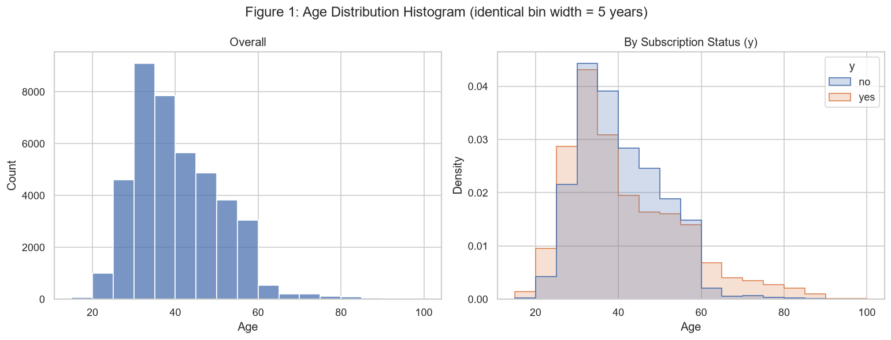

### Figure 2 - Age Boxplot by Subscription Status

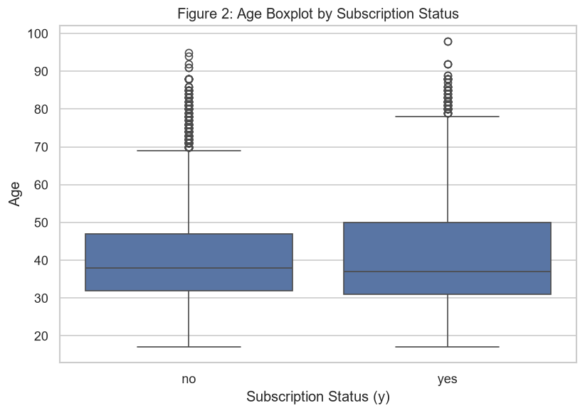

### Figure 3 - Subscription Rate by Job

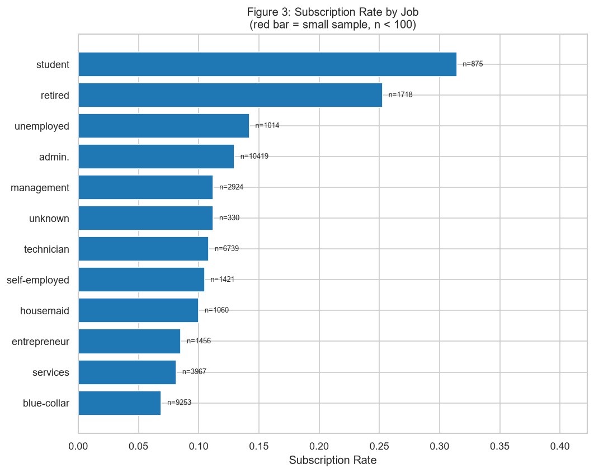

### Figure 4 - Subscription Rate by Marital Status

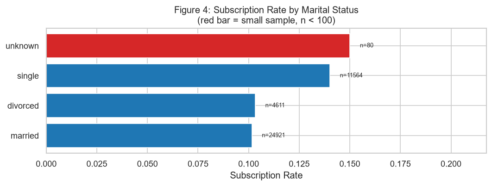

### Figure 5 - Subscription Rate by Education

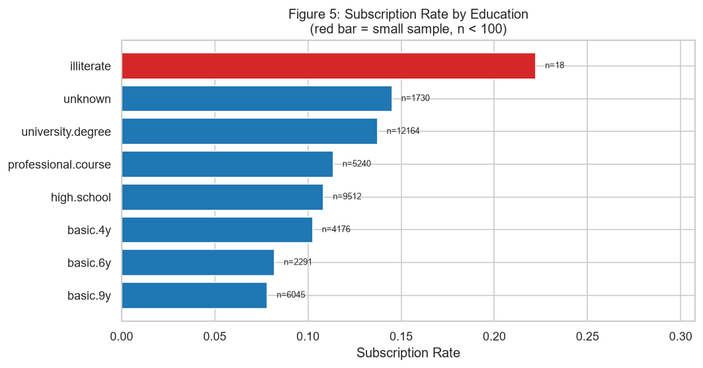

### Figure 6 - Subscription Rate by Default Status

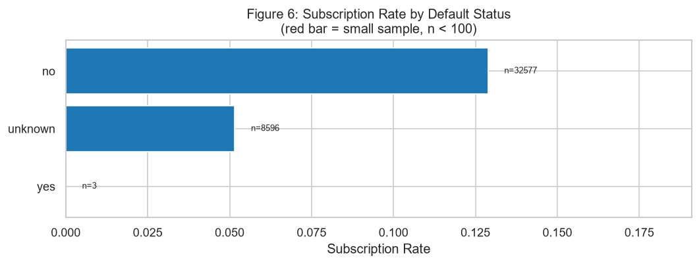

### Figure 7 - Subscription Rate by Housing Loan

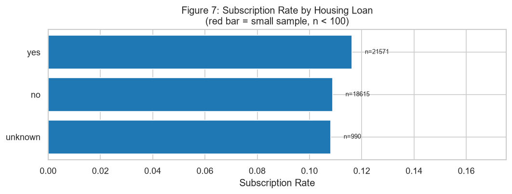

### Figure 8 - Subscription Rate by Personal Loan

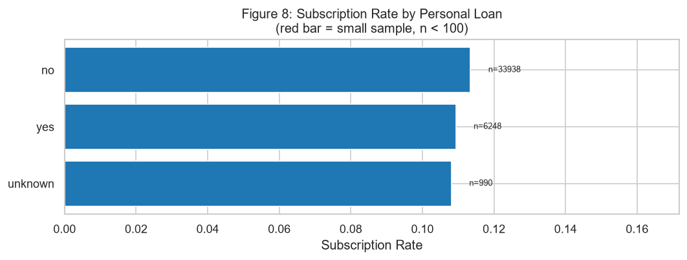
