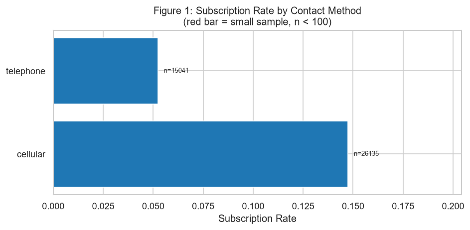
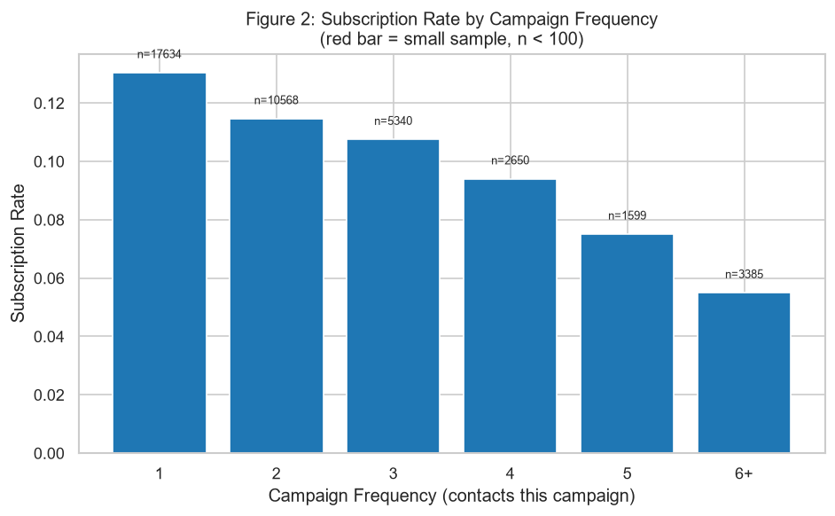
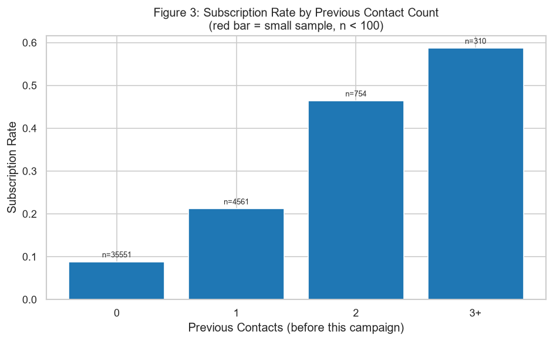
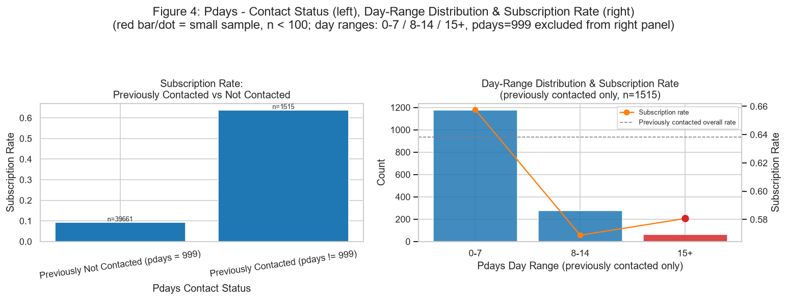
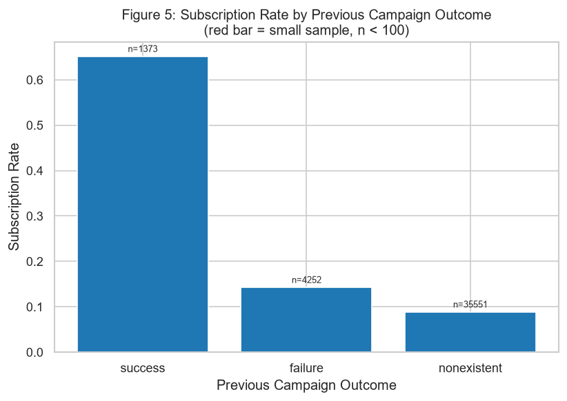
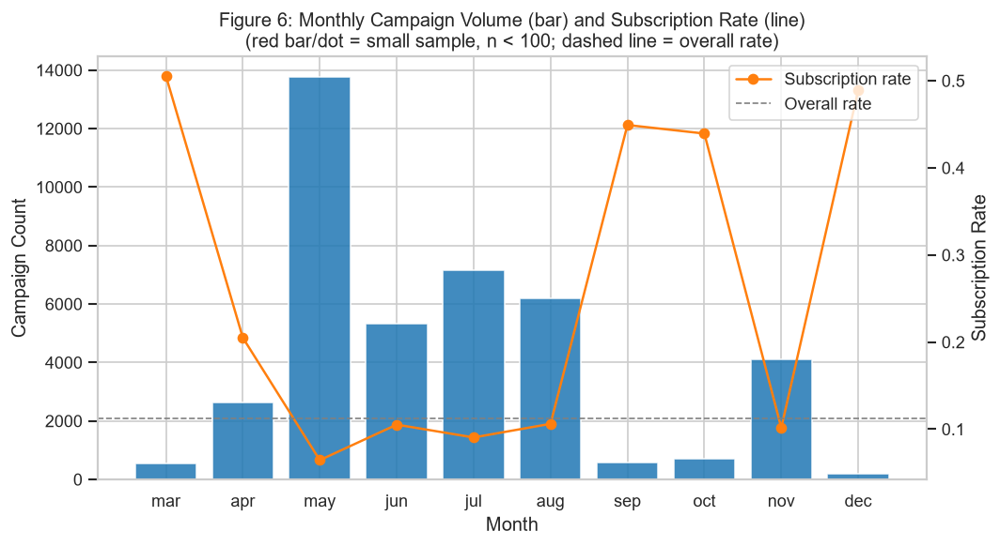
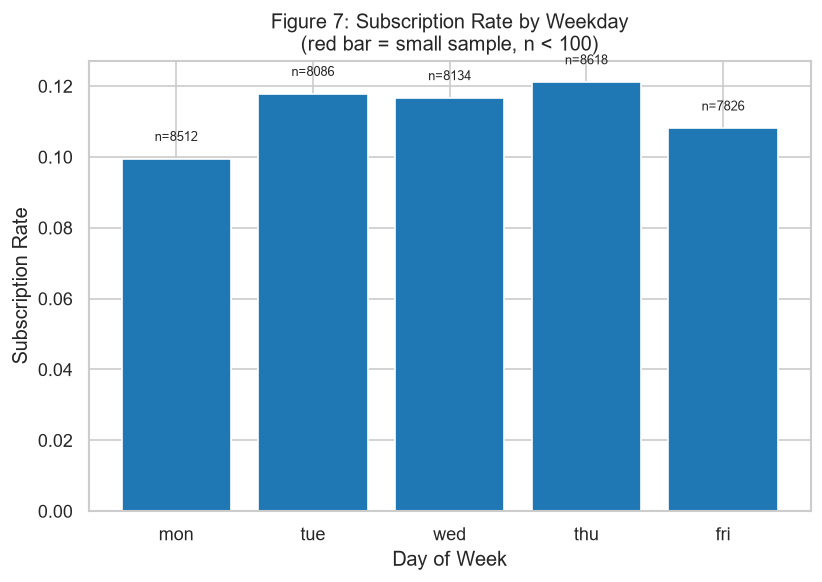

# Module 2 - Campaign Strategy Evaluation: Summary Report

*Business question: Which telephone marketing strategies and historical campaign characteristics are associated with higher term deposit subscription rates?*

*Data source: `C:\Users\maggie\Desktop\Bank Marketing\bank-additional\bank-additional\bank-additional-full.csv` (raw), cleaned by removing 12 exact duplicate rows -> 41176 observations analyzed. `duration` excluded (data leakage).*

## Observation
- Data source (raw file): `C:\Users\maggie\Desktop\Bank Marketing\bank-additional\bank-additional\bank-additional-full.csv`.
- After removing 12 exact duplicate rows (41188 rows before -> 41176 rows after), the cleaned dataset used for this module contains 41176 observations and the 8 columns required for campaign strategy analysis: ['contact', 'campaign', 'previous', 'pdays', 'poutcome', 'month', 'day_of_week', 'y'].
- `duration` was excluded from this module (data leakage - only known after a call ends).
- Overall term deposit subscription rate is 0.1127 (4639 yes out of 41176 observations).
- `campaign` (contacts made during this campaign) ranges from 1 to 56, mean=2.57, median=2.0.
- `previous` (contacts before this campaign) ranges from 0 to 7, mean=0.17, median=0.0.
- `pdays` = 999 is treated as its own category, "Previously Not Contacted (pdays = 999)", NOT as a numeric day count. It applies to 39661 observations (96% of the dataset, rounded); `pdays` is therefore excluded from Table 1's mean/quartile statistics (see Table 5 and Table 5b for the interpretable breakdowns).
- For the 1515 observations previously contacted (`pdays` != 999), actual day values range from 0 to 27 days (mean=6.01, median=6.0), concentrated well below 30 days; see Table 5c and Figure 4 (right panel) for a coarse day-range (0-7 / 8-14 / 15+) breakdown paired with subscription rate.
- `previous` >= 1 applies to 5625 observations, which is NOT identical to the 1515 observations with `pdays` != 999 in this dataset; the two fields are related but not interchangeable, and each is analyzed on its own terms above.
- `poutcome` = 'nonexistent' accounts for 35551 observations, 'failure' for 4252, and 'success' for 1373.

## Key Statistics
- Dataset size (cleaned): 41176 observations; overall subscription rate: 0.1127.
- Contact method: highest subscription rate = `cellular` (0.1474, n=26135); lowest = `telephone` (0.0523, n=15041); 0 of 2 categories flagged as small sample (n<100).
- Campaign frequency: highest subscription rate = `1` (0.1304, n=17634); lowest = `6+` (0.0549, n=3385); 0 of 6 categories flagged as small sample (n<100).
- Previous contact count: highest subscription rate = `3+` (0.5871, n=310); lowest = `0` (0.0883, n=35551); 0 of 4 categories flagged as small sample (n<100).
- Previous contact (simplified: 0 vs >=1): highest subscription rate = `>=1` (0.2665, n=5625); lowest = `0` (0.0883, n=35551); 0 of 2 categories flagged as small sample (n<100).
- Pdays contact status: highest subscription rate = `Previously Contacted (pdays != 999)` (0.6383, n=1515); lowest = `Previously Not Contacted (pdays = 999)` (0.0926, n=39661); 0 of 2 categories flagged as small sample (n<100).
- Pdays day range (previously contacted only): highest subscription rate = `0-7` (0.6576, n=1177); lowest = `8-14` (0.5688, n=276); 1 of 3 categories flagged as small sample (n<100).
- Previous campaign outcome: highest subscription rate = `success` (0.6511, n=1373); lowest = `nonexistent` (0.0883, n=35551); 0 of 3 categories flagged as small sample (n<100).
- Month: highest subscription rate = `mar` (0.5055, n=546); lowest = `may` (0.0644, n=13767); 0 of 10 categories flagged as small sample (n<100).
- Weekday: highest subscription rate = `thu` (0.1211, n=8618); lowest = `mon` (0.0995, n=8512); 0 of 5 categories flagged as small sample (n<100).
- Pdays (previously contacted only, n=1515): actual day values range 0-27 days, mean=6.01, median=6.0; see Table 5c / Figure 4 for the coarse day-range subscription-rate comparison above.
- Contribution to total positive class (yes) by `poutcome`: highest is `nonexistent` (0.6769, i.e. 67.69% of all subscribers, from 35551 observations, 86.34% of the dataset).

## Notable Patterns
- Customers contacted 6 or more times during this campaign represent 3385 observations (8.22% of the dataset); this is a small share relative to customers contacted 1-5 times.
- The `previous`, `pdays`, and `poutcome` variables are highly imbalanced: most customers have `previous`=0, `pdays`=999 (not previously contacted), and `poutcome`='nonexistent', consistent with each other (no prior campaign contact).
- Within `previous` (Table 4), the `2` (n=754) and `3+` (n=310) categories are considerably smaller samples than `0` and `1`; their subscription rates are reported but should be interpreted cautiously given the limited sample size. The simplified `0` vs `>=1` split (Table 4b) avoids this sparsity by pooling all previously-contacted customers into one group.
- Among previously-contacted customers (`pdays` != 999, n=1515), actual day values are heavily concentrated at low values (median 6.0 days) with a long, thin tail out to 27 days. Table 5c / Figure 4 pair a coarse day-range grouping (0-7 / 8-14 / 15+) with subscription rate for a more stable comparison than the raw day values would allow. Day-range group(s) `15+` (n=62) have count < 100 (flagged `small_sample_flag`, shown as a red bar/dot in Figure 4); their subscription rates should be read with caution rather than compared precisely against the other groups.
- `poutcome`='success' has 1373 observations, a much smaller share than 'nonexistent'; its subscription rate should be read together with this smaller sample size. Despite its small size, its contribution to the total positive class is 19.27% (see Table 6), disproportionately high relative to its share of the dataset.
- Campaign volume is not evenly distributed across months: the highest-volume month is `may` (n=13767), while the highest subscription-rate month is `mar` (rate=0.5055, n=546). Month comparisons should consider both rate and volume together (see Figure 6, combined view).
- This module identifies statistical associations between campaign characteristics and subscription outcomes only; it does not establish whether a particular campaign strategy directly causes higher subscription rates. Customer characteristics and macroeconomic conditions are analyzed in separate modules to avoid overlapping interpretation.

## Business Summary

*Business question: Which telephone marketing strategies and historical campaign characteristics are associated with higher term deposit subscription rates?*

### Overall Conclusion
- Contact channel matters in the observed data: `cellular` contacts show a higher subscription rate (0.1474, n=26135) than `telephone` contacts (0.0523, n=15041).
- Lower contact frequency during the current campaign is associated with higher observed subscription rates: one contact has the highest rate (0.1304, n=17634), while `6+` contacts has the lowest rate (0.0549, n=3385).
- Prior campaign engagement is the strongest descriptive signal in this module: customers with `previous >= 1` show a higher rate (0.2665, n=5625) than `previous = 0` (0.0883, n=35551); `pdays != 999` also has a higher rate (0.6383, n=1515) than `pdays = 999` (0.0926, n=39661).
- `poutcome = success` has the highest previous-outcome subscription rate (0.6511, n=1373) and contributes 19.27% of all positive cases, despite representing only 3.33% of observations.
- Timing patterns are uneven: the highest subscription-rate month is `mar` (0.5055, n=546), while the highest-volume month is `may` (n=13767, rate=0.0644). Weekday differences are comparatively modest, from `mon` (0.0995) to `thu` (0.1211).

### Business Implications
- Prioritize `cellular` as the observed contact channel associated with higher subscription rates, while recognizing that this is a descriptive association and may reflect customer/channel mix.
- Use early campaign contacts more carefully: customers contacted once show the strongest observed rate, whereas repeated `6+` contacts are associated with the lowest rate in this module.
- Treat prior positive engagement (`previous >= 1`, `pdays != 999`, and especially `poutcome = success`) as a business targeting signal for follow-up prioritization, not as a predictive score.
- For customers with actual previous-contact day values, the `0-7` day group has the highest observed rate (0.6576, n=1177); the `15+` group is small (n=62) and should be treated as a cautionary reference rather than a planning rule.
- Use month-level results to support campaign calendar planning, balancing rate and volume: months with high rates are often much lower volume than the main campaign months.
- Channel planning can be informed by the observed higher subscription rate for `cellular` versus `telephone` contacts.
- Contact-frequency management can be informed by the declining observed rates from first contact to high repeated-contact groups (`6+`).
- Follow-up prioritization can use prior campaign engagement as a descriptive signal, especially `poutcome = success`, `previous >= 1`, and `pdays != 999`.
- Campaign calendar review can use the month-level volume/rate contrast to avoid relying only on volume-heavy months when assessing timing performance.

### Limitations
- This module is descriptive EDA only. It does not control for customer profile, macroeconomic conditions, offer context, or channel assignment effects, and it does not establish causality.
- `pdays`, `previous`, and `poutcome` are highly imbalanced: `pdays = 999` and `poutcome = nonexistent` dominate the dataset, while the actual `pdays` day-value subset contains only 1515 observations.
- Some high-rate categories have limited sample sizes or concentrated distributions, including `previous = 3+` (n=310) and the `pdays` `15+` group (n=62).
- `duration` is intentionally excluded because it is only known after a call ends and would cause data leakage for pre-contact campaign strategy evaluation.
- `previous >= 1` and `pdays != 999` are related but not interchangeable in this dataset, so business interpretation should keep these fields separate.
- Do not interpret high rates for prior-success or previously-contacted customers as proof that previous contact caused subscription; these groups may differ systematically from the broader population.
- Do not treat high-rate low-volume months as automatically scalable campaign windows; monthly volume is uneven and may reflect campaign design or seasonality outside this module.
- Do not overstate small or sparse groups, including `previous = 3+` and `pdays` `15+` (n=62).
- Do not use weekday differences as a primary targeting rule; the observed range is narrow compared with channel, prior-engagement, and month-level differences.
- Do not convert these findings into an individual-level prediction or scoring rule without a separate modeling workflow and validation.

## Appendix: Data Tables

### Table 1 - Campaign Summary Statistics (campaign / previous)

*Note: `pdays` is excluded from this table. Its value of 999 is a sentinel category (not previously contacted), not an actual day count, so mean/median/quartile statistics over it would not be meaningful. See Table 5 (contacted vs not contacted) and Table 5b (actual day statistics, pdays != 999 only) for the interpretable breakdowns.*

| index | count | mean | median | std | min | 25% | 50% | 75% | max |
| --- | --- | --- | --- | --- | --- | --- | --- | --- | --- |
| campaign | 41176.0000 | 2.5679 | 2.0000 | 2.7703 | 1.0000 | 1.0000 | 2.0000 | 3.0000 | 56.0000 |
| previous | 41176.0000 | 0.1730 | 0.0000 | 0.4950 | 0.0000 | 0.0000 | 0.0000 | 0.0000 | 7.0000 |

### Table 2 - Contact Method Summary

*Displayed in calendar/natural/logical order (not sorted by subscription rate); `rate_rank` reports the subscription-rate ranking (1 = highest) per the Ranking Analysis method. Categories with count < 100 are flagged `small_sample_flag = Yes`.*

| contact | count | percentage | yes | subscription_rate | rate_rank | small_sample_flag |
| --- | --- | --- | --- | --- | --- | --- |
| cellular | 26135 | 63.4714 | 3852 | 0.1474 | 1.0000 | No |
| telephone | 15041 | 36.5286 | 787 | 0.0523 | 2.0000 | No |

### Table 3 - Campaign Frequency Summary

*Displayed in calendar/natural/logical order (not sorted by subscription rate); `rate_rank` reports the subscription-rate ranking (1 = highest) per the Ranking Analysis method. Categories with count < 100 are flagged `small_sample_flag = Yes`.*

| campaign_group | count | percentage | yes | subscription_rate | rate_rank | small_sample_flag |
| --- | --- | --- | --- | --- | --- | --- |
| 1 | 17634 | 42.8259 | 2299 | 0.1304 | 1.0000 | No |
| 2 | 10568 | 25.6654 | 1211 | 0.1146 | 2.0000 | No |
| 3 | 5340 | 12.9687 | 574 | 0.1075 | 3.0000 | No |
| 4 | 2650 | 6.4358 | 249 | 0.0940 | 4.0000 | No |
| 5 | 1599 | 3.8833 | 120 | 0.0750 | 5.0000 | No |
| 6+ | 3385 | 8.2208 | 186 | 0.0549 | 6.0000 | No |

### Table 4 - Previous Contact Summary

*Displayed in calendar/natural/logical order (not sorted by subscription rate); `rate_rank` reports the subscription-rate ranking (1 = highest) per the Ranking Analysis method. Categories with count < 100 are flagged `small_sample_flag = Yes`.*

| previous_group | count | percentage | yes | subscription_rate | rate_rank | small_sample_flag |
| --- | --- | --- | --- | --- | --- | --- |
| 0 | 35551 | 86.3391 | 3140 | 0.0883 | 4.0000 | No |
| 1 | 4561 | 11.0768 | 967 | 0.2120 | 3.0000 | No |
| 2 | 754 | 1.8312 | 350 | 0.4642 | 2.0000 | No |
| 3+ | 310 | 0.7529 | 182 | 0.5871 | 1.0000 | No |

### Table 4b - Previous Contact Summary (Simplified: 0 vs >=1)

*Displayed in calendar/natural/logical order (not sorted by subscription rate); `rate_rank` reports the subscription-rate ranking (1 = highest) per the Ranking Analysis method. Categories with count < 100 are flagged `small_sample_flag = Yes`.*

| previous_binary | count | percentage | yes | subscription_rate | rate_rank | small_sample_flag |
| --- | --- | --- | --- | --- | --- | --- |
| 0 | 35551 | 86.3391 | 3140 | 0.0883 | 2.0000 | No |
| >=1 | 5625 | 13.6609 | 1499 | 0.2665 | 1.0000 | No |

### Table 5 - Pdays: Contacted vs Not Contacted Summary

*Displayed in calendar/natural/logical order (not sorted by subscription rate); `rate_rank` reports the subscription-rate ranking (1 = highest) per the Ranking Analysis method. Categories with count < 100 are flagged `small_sample_flag = Yes`.*

| pdays_contact_status | count | percentage | yes | subscription_rate | rate_rank | small_sample_flag |
| --- | --- | --- | --- | --- | --- | --- |
| Previously Not Contacted (pdays = 999) | 39661 | 96.3207 | 3672 | 0.0926 | 2.0000 | No |
| Previously Contacted (pdays != 999) | 1515 | 3.6793 | 967 | 0.6383 | 1.0000 | No |

### Table 5b - Pdays Distribution (Previously Contacted Only, actual days)

*Descriptive statistics of actual `pdays` day values, computed ONLY on the 1515 rows where `pdays` != 999 (pdays = 999 is excluded here since it is not a day count). See Table 5c and Figure 4 (right panel) for a coarse day-range breakdown of this same subset paired with subscription rate.*

| index | count | mean | median | std | min | 25% | 50% | 75% | max |
| --- | --- | --- | --- | --- | --- | --- | --- | --- | --- |
| pdays (previously contacted only) | 1515.0000 | 6.0145 | 6.0000 | 3.8249 | 0.0000 | 3.0000 | 6.0000 | 7.0000 | 27.0000 |

### Table 5c - Pdays Day-Range Summary (Previously Contacted Only)

*Displayed in calendar/natural/logical order (not sorted by subscription rate); `rate_rank` reports the subscription-rate ranking (1 = highest) per the Ranking Analysis method. Categories with count < 100 are flagged `small_sample_flag = Yes`.*

| pdays_days_group | count | percentage | yes | subscription_rate | rate_rank | small_sample_flag |
| --- | --- | --- | --- | --- | --- | --- |
| 0-7 | 1177 | 77.6898 | 774 | 0.6576 | 1.0000 | No |
| 8-14 | 276 | 18.2178 | 157 | 0.5688 | 3.0000 | No |
| 15+ | 62 | 4.0924 | 36 | 0.5806 | 2.0000 | Yes |

### Table 6 - Previous Campaign Outcome Summary

*Displayed in calendar/natural/logical order (not sorted by subscription rate); `rate_rank` reports the subscription-rate ranking (1 = highest) per the Ranking Analysis method. Categories with count < 100 are flagged `small_sample_flag = Yes`. `contribution_to_yes` = (yes count in this category) / (total yes count across the whole dataset), i.e. this category's share of all positive-class (subscribed) customers.*

| poutcome | count | percentage | yes | subscription_rate | rate_rank | contribution_to_yes | small_sample_flag |
| --- | --- | --- | --- | --- | --- | --- | --- |
| success | 1373 | 3.3345 | 894 | 0.6511 | 1.0000 | 0.1927 | No |
| failure | 4252 | 10.3264 | 605 | 0.1423 | 2.0000 | 0.1304 | No |
| nonexistent | 35551 | 86.3391 | 3140 | 0.0883 | 3.0000 | 0.6769 | No |

### Table 7 - Monthly Campaign Summary

*Displayed in calendar/natural/logical order (not sorted by subscription rate); `rate_rank` reports the subscription-rate ranking (1 = highest) per the Ranking Analysis method. Categories with count < 100 are flagged `small_sample_flag = Yes`.*

| month | count | percentage | yes | subscription_rate | rate_rank | small_sample_flag |
| --- | --- | --- | --- | --- | --- | --- |
| mar | 546 | 1.3260 | 276 | 0.5055 | 1.0000 | No |
| apr | 2631 | 6.3896 | 539 | 0.2049 | 5.0000 | No |
| may | 13767 | 33.4345 | 886 | 0.0644 | 10.0000 | No |
| jun | 5318 | 12.9153 | 559 | 0.1051 | 7.0000 | No |
| jul | 7169 | 17.4106 | 648 | 0.0904 | 9.0000 | No |
| aug | 6176 | 14.9990 | 655 | 0.1061 | 6.0000 | No |
| sep | 570 | 1.3843 | 256 | 0.4491 | 3.0000 | No |
| oct | 717 | 1.7413 | 315 | 0.4393 | 4.0000 | No |
| nov | 4100 | 9.9573 | 416 | 0.1015 | 8.0000 | No |
| dec | 182 | 0.4420 | 89 | 0.4890 | 2.0000 | No |

### Table 8 - Weekday Campaign Summary

*Displayed in calendar/natural/logical order (not sorted by subscription rate); `rate_rank` reports the subscription-rate ranking (1 = highest) per the Ranking Analysis method. Categories with count < 100 are flagged `small_sample_flag = Yes`.*

| day_of_week | count | percentage | yes | subscription_rate | rate_rank | small_sample_flag |
| --- | --- | --- | --- | --- | --- | --- |
| mon | 8512 | 20.6722 | 847 | 0.0995 | 5.0000 | No |
| tue | 8086 | 19.6377 | 953 | 0.1179 | 2.0000 | No |
| wed | 8134 | 19.7542 | 949 | 0.1167 | 3.0000 | No |
| thu | 8618 | 20.9297 | 1044 | 0.1211 | 1.0000 | No |
| fri | 7826 | 19.0062 | 846 | 0.1081 | 4.0000 | No |

## Figures

### Figure 1 - Subscription Rate by Contact Method

### Figure 2 - Subscription Rate by Campaign Frequency

### Figure 3 - Subscription Rate by Previous Contact Count

### Figure 4 - Pdays: Contact Status, and Day-Range Distribution & Subscription Rate

### Figure 5 - Subscription Rate by Previous Campaign Outcome

### Figure 6 - Monthly Campaign Volume and Subscription Rate (dual axis)

### Figure 7 - Subscription Rate by Weekday

