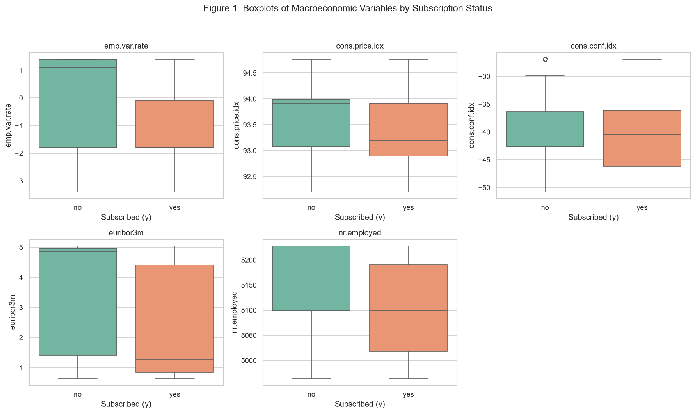
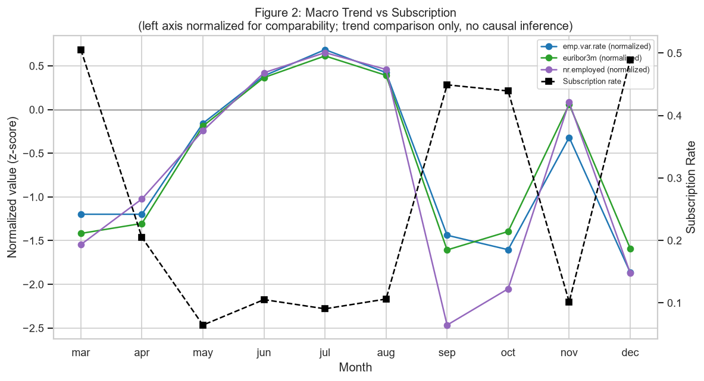
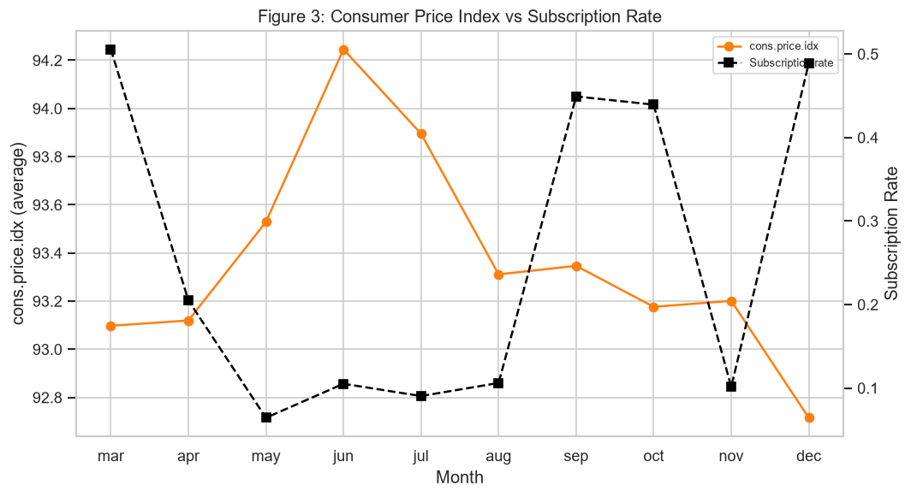
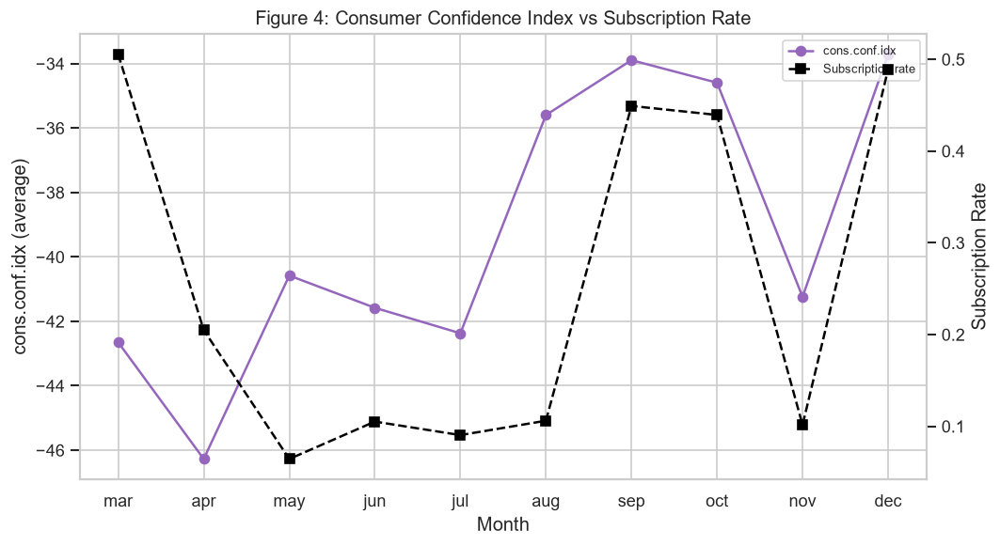
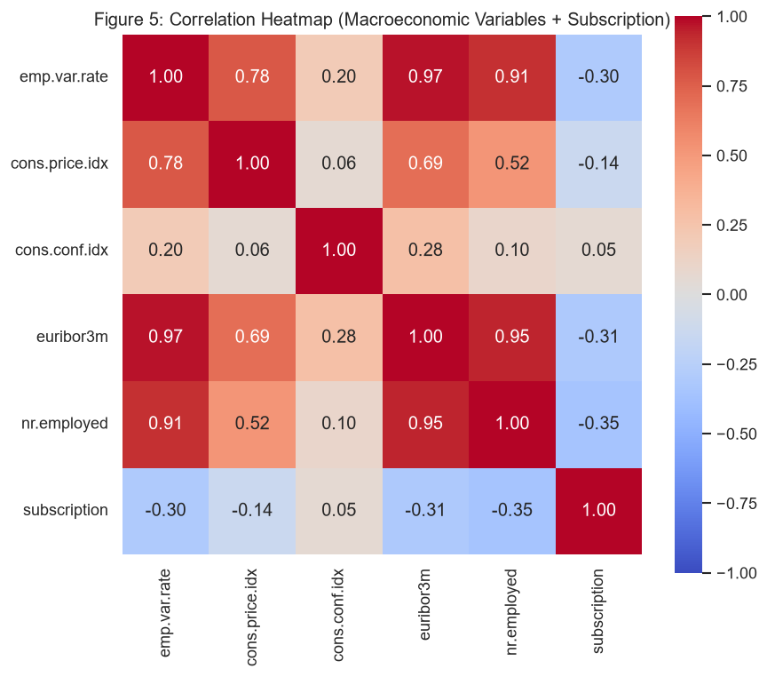
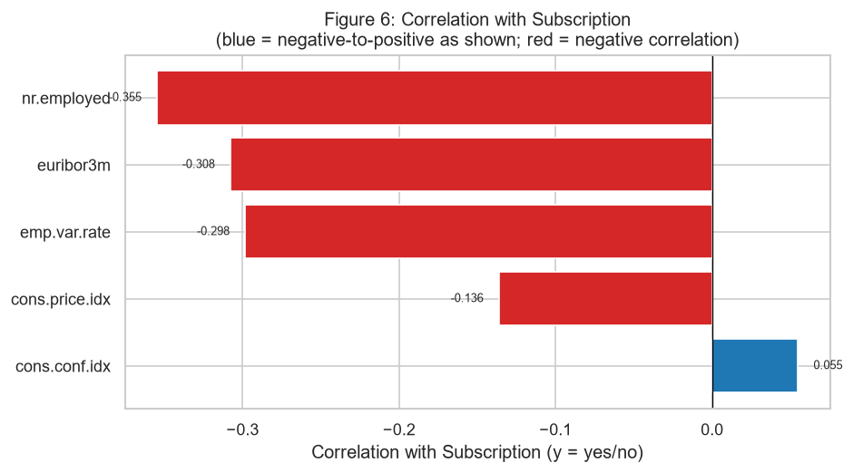

# Module 3 - Market Environment Analysis: Summary Report

*Business question: How are macroeconomic conditions associated with term deposit subscription, and should changes in the economic environment be considered when evaluating telephone marketing performance?*

*Data source: `C:\Users\maggie\Desktop\Bank Marketing\bank-additional\bank-additional\bank-additional-full.csv` (raw), cleaned by removing 12 exact duplicate rows -> 41176 observations analyzed.*

## Observation
- Data source (raw file): `C:\Users\maggie\Desktop\Bank Marketing\bank-additional\bank-additional\bank-additional-full.csv`.
- After removing 12 exact duplicate rows (41188 rows before -> 41176 rows after), the cleaned dataset used for this module contains 41176 observations and the 7 columns required for market environment analysis: ['emp.var.rate', 'cons.price.idx', 'cons.conf.idx', 'euribor3m', 'nr.employed', 'month', 'y'].
- Overall term deposit subscription rate is 0.1127 (4639 yes out of 41176 observations).
- `emp.var.rate` ranges from -3.400 to 1.400, mean=0.082, median=1.100, std=1.571.
- `cons.price.idx` ranges from 92.201 to 94.767, mean=93.576, median=93.749, std=0.579.
- `cons.conf.idx` ranges from -50.800 to -26.900, mean=-40.503, median=-41.800, std=4.628.
- `euribor3m` ranges from 0.634 to 5.045, mean=3.621, median=4.857, std=1.734.
- `nr.employed` ranges from 4963.600 to 5228.100, mean=5167.035, median=5191.000, std=72.251.
- The dataset covers 10 calendar months (mar, apr, may, jun, jul, aug, sep, oct, nov, dec); `month` is used only to order observations chronologically.

## Key Statistics
- Dataset size (cleaned): 41176 observations; overall subscription rate: 0.1127.
- `emp.var.rate`: mean (yes) = -1.233 vs mean (no) = 0.249 (difference = -1.482); median (yes) = -1.800, median (no) = 1.100.
- `cons.price.idx`: mean (yes) = 93.355 vs mean (no) = 93.604 (difference = -0.249); median (yes) = 93.200, median (no) = 93.918.
- `cons.conf.idx`: mean (yes) = -39.791 vs mean (no) = -40.593 (difference = 0.802); median (yes) = -40.400, median (no) = -41.800.
- `euribor3m`: mean (yes) = 2.123 vs mean (no) = 3.811 (difference = -1.688); median (yes) = 1.266, median (no) = 4.857.
- `nr.employed`: mean (yes) = 5095.120 vs mean (no) = 5176.166 (difference = -81.046); median (yes) = 5099.100, median (no) = 5195.800.
- Correlation with subscription: strongest is `nr.employed` (-0.3547); weakest is `cons.conf.idx` (0.0548).
- Monthly campaign volume is highest in `may` (n=13767); monthly subscription rate is highest in `mar` (0.5055).
- 3 variable pair(s) meet the |r| >= 0.8 threshold: `emp.var.rate` & `euribor3m` (r=0.972); `euribor3m` & `nr.employed` (r=0.945); `emp.var.rate` & `nr.employed` (r=0.907).

## Notable Patterns
- `nr.employed` and `euribor3m` show relatively stronger (negative) correlation with subscription than the other macroeconomic variables, while `cons.conf.idx` shows the weakest association in this dataset.
- Several macroeconomic variables move together and carry overlapping information: `emp.var.rate` and `euribor3m` (r=0.972); `euribor3m` and `nr.employed` (r=0.945); `emp.var.rate` and `nr.employed` (r=0.907). This overlap (multicollinearity) means these variables should be interpreted collectively rather than ranked independently by importance.
- Monthly subscription rate varies more than monthly campaign volume would alone suggest: the highest-volume month (`may`, n=13767) is not the same as the highest-rate month (`mar`, rate=0.5055). Because macroeconomic indicators also vary by month (see Table 3, Figures 2-4), month-to-month differences in subscription rate may coincide with concurrent changes in multiple macroeconomic indicators rather than reflecting an independent monthly effect.
- All customers contacted during the same period share identical macroeconomic conditions; these 5 variables describe the shared economic environment at the time of contact rather than individual customer characteristics. Observed correlations with subscription therefore reflect statistical association with the broader market context, not customer-level behavior.
- Correlation does not imply causation: the associations reported above (Table 5, Figure 6; see also Figure 5 for the extended heatmap including subscription) are statistical associations only. Changes in macroeconomic indicators should not be interpreted as direct causes of subscription behavior.
- The dataset covers a specific campaign period rather than multiple economic cycles, so the relationships observed here may not generalize to different macroeconomic environments. This module evaluates association only; it does not evaluate policy effectiveness, estimate economic impacts, or attribute subscription changes to specific indicators. Customer characteristics and campaign execution are evaluated separately in Modules 1 and 2.

## Business Summary

*Business question: Are macroeconomic conditions associated with term deposit subscription, and should the bank consider market environment when planning telephone marketing strategy?*

### Overall Conclusion
- Overall, macroeconomic conditions show an observable statistical association with term deposit subscription; in the existing correlation analysis, `nr.employed` has the strongest association with subscription (r=-0.3547), and the direction is negative.
- `nr.employed`, `euribor3m`, and `emp.var.rate` are the three indicators most worth monitoring; they show visible differences in the Yes/No distribution comparison and higher absolute correlations in the correlation bar chart and heatmap.
- `cons.price.idx` has a relatively weaker association with subscription, while `cons.conf.idx` is the weakest indicator in this module (r=0.0548); it should not be used as the main basis for judgment.
- Trend analysis shows that monthly subscription-rate changes coincide with monthly movements in multiple macroeconomic indicators; however, these trends only show that market context and subscription rates moved together, not that macroeconomic conditions directly caused subscription-rate changes.

### Business Implications
- When planning telephone marketing and evaluating performance, the bank should include macroeconomic conditions as background context; subscription-rate differences across months should not be explained only by contact volume or a single campaign execution metric.
- `nr.employed`, `euribor3m`, and `emp.var.rate` can be used as reference indicators for market environment monitoring and performance interpretation, especially when comparing telephone marketing performance across different months and market states.
- When campaign performance differs noticeably across months, market environment can serve as a supporting explanatory context; when subscription-rate changes move alongside rate or employment-related indicators, managers should avoid attributing the pattern only to marketing execution.
- Macroeconomic indicators should not be used as the only decision basis; actual list selection, contact method, contact frequency, and customer characteristics should still be interpreted together with the results from Module 1 and Module 2.

### Limitations
- Macro variables are highly tied to `month`: customers contacted during the same period share the same market environment, so this analysis cannot clearly separate month effects, marketing arrangement effects, and macroeconomic effects.
- This module is observational EDA only. It presents distribution differences, correlation coefficients, and trend consistency; it cannot infer that any macroeconomic indicator has a causal effect on subscription behavior.
- Several macroeconomic indicators are highly correlated with each other, especially `emp.var.rate` and `euribor3m` (r=0.972); `euribor3m` and `nr.employed` (r=0.945); `emp.var.rate` and `nr.employed` (r=0.907); therefore, a single indicator should not be interpreted independently as the main driver.
- The data covers a specific campaign period rather than multiple full economic cycles; therefore, the findings are suitable for interpreting market context during this dataset period and should not be directly generalized to all market environments.

## Appendix: Data Tables

### Table 1 - Macroeconomic Summary Statistics

*Mean / median / standard deviation / min / max / quartiles for each macroeconomic variable, cleaned dataset (n=41176).*

| index | count | mean | median | std | min | 25% | 50% | 75% | max |
| --- | --- | --- | --- | --- | --- | --- | --- | --- | --- |
| emp.var.rate | 41176.0000 | 0.0819 | 1.1000 | 1.5709 | -3.4000 | -1.8000 | 1.1000 | 1.4000 | 1.4000 |
| cons.price.idx | 41176.0000 | 93.5757 | 93.7490 | 0.5788 | 92.2010 | 93.0750 | 93.7490 | 93.9940 | 94.7670 |
| cons.conf.idx | 41176.0000 | -40.5029 | -41.8000 | 4.6279 | -50.8000 | -42.7000 | -41.8000 | -36.4000 | -26.9000 |
| euribor3m | 41176.0000 | 3.6213 | 4.8570 | 1.7344 | 0.6340 | 1.3440 | 4.8570 | 4.9610 | 5.0450 |
| nr.employed | 41176.0000 | 5167.0349 | 5191.0000 | 72.2514 | 4963.6000 | 5099.1000 | 5191.0000 | 5228.1000 | 5228.1000 |

### Table 2 - Macroeconomic Statistics by Subscription Status

*Mean / median / standard deviation of each macroeconomic variable, computed separately for subscribed (`y = yes`) and non-subscribed (`y = no`) customers. `mean_diff (yes - no)` = mean (yes) - mean (no).*

| variable | n_yes | mean_yes | median_yes | std_yes | n_no | mean_no | median_no | std_no | mean_diff (yes - no) |
| --- | --- | --- | --- | --- | --- | --- | --- | --- | --- |
| emp.var.rate | 4639 | -1.2331 | -1.8000 | 1.6236 | 36537 | 0.2489 | 1.1000 | 1.4829 | -1.4820 |
| cons.price.idx | 4639 | 93.3546 | 93.2000 | 0.6766 | 36537 | 93.6038 | 93.9180 | 0.5590 | -0.2492 |
| cons.conf.idx | 4639 | -39.7911 | -40.4000 | 6.1397 | 36537 | -40.5932 | -41.8000 | 4.3908 | 0.8021 |
| euribor3m | 4639 | 2.1234 | 1.2660 | 1.7427 | 36537 | 3.8115 | 4.8570 | 1.6382 | -1.6881 |
| nr.employed | 4639 | 5095.1201 | 5099.1000 | 87.5816 | 36537 | 5176.1657 | 5195.8000 | 64.5703 | -81.0456 |

### Table 3 - Monthly Market Summary

*Displayed in calendar order. `count` = campaign contacts, `yes` = subscription count, `subscription_rate` = yes / count; remaining columns are the average macroeconomic value for that month.*

| month | count | yes | subscription_rate | emp.var.rate | cons.price.idx | cons.conf.idx | euribor3m | nr.employed |
| --- | --- | --- | --- | --- | --- | --- | --- | --- |
| mar | 546 | 276 | 0.5055 | -1.8000 | 93.0973 | -42.6505 | 1.1627 | 5055.3901 |
| apr | 2631 | 539 | 0.2049 | -1.8000 | 93.1196 | -46.2733 | 1.3610 | 5093.1214 |
| may | 13767 | 886 | 0.0644 | -0.1649 | 93.5289 | -40.5792 | 3.2937 | 5149.5222 |
| jun | 5318 | 559 | 0.1051 | 0.6884 | 94.2454 | -41.5794 | 4.2569 | 5197.4932 |
| jul | 7169 | 648 | 0.0904 | 1.1594 | 93.8951 | -42.3712 | 4.6860 | 5214.0900 |
| aug | 6176 | 655 | 0.1061 | 0.7469 | 93.3110 | -35.5970 | 4.3004 | 5200.2393 |
| sep | 570 | 256 | 0.4491 | -2.1774 | 93.3465 | -33.8932 | 0.8348 | 4988.8479 |
| oct | 717 | 315 | 0.4393 | -2.4372 | 93.1761 | -34.5916 | 1.2008 | 5018.8257 |
| nov | 4100 | 416 | 0.1015 | -0.4186 | 93.2009 | -41.2386 | 3.7230 | 5173.0257 |
| dec | 182 | 89 | 0.4890 | -2.8462 | 92.7154 | -33.7088 | 0.8653 | 5031.8956 |

### Table 4 - Correlation Matrix (Macroeconomic Variables)

*Pearson correlation coefficients among the 5 macroeconomic variables.*

| index | emp.var.rate | cons.price.idx | cons.conf.idx | euribor3m | nr.employed |
| --- | --- | --- | --- | --- | --- |
| emp.var.rate | 1.0000 | 0.7753 | 0.1963 | 0.9722 | 0.9069 |
| cons.price.idx | 0.7753 | 1.0000 | 0.0592 | 0.6882 | 0.5219 |
| cons.conf.idx | 0.1963 | 0.0592 | 1.0000 | 0.2779 | 0.1007 |
| euribor3m | 0.9722 | 0.6882 | 0.2779 | 1.0000 | 0.9451 |
| nr.employed | 0.9069 | 0.5219 | 0.1007 | 0.9451 | 1.0000 |

### Table 5 - Correlation with Subscription

*Pearson correlation between each macroeconomic variable and subscription status (`y` encoded as yes=1 / no=0; equivalent to point-biserial correlation). Sorted by absolute correlation, descending.*

| rank | variable | correlation_with_subscription |
| --- | --- | --- |
| 1 | nr.employed | -0.3547 |
| 2 | euribor3m | -0.3077 |
| 3 | emp.var.rate | -0.2983 |
| 4 | cons.price.idx | -0.1361 |
| 5 | cons.conf.idx | 0.0548 |

### Table 6 - Highly Correlated Variable Pairs (|r| >= 0.80)

*Variable pairs with |correlation| >= 0.8, from Table 4, sorted by absolute correlation, descending.*

| variable_1 | variable_2 | correlation |
| --- | --- | --- |
| emp.var.rate | euribor3m | 0.9722 |
| euribor3m | nr.employed | 0.9451 |
| emp.var.rate | nr.employed | 0.9069 |

## Figures

### Figure 1 - Boxplots of Macroeconomic Variables by Subscription Status

### Figure 2 - Macro Trend vs Subscription (Normalized emp.var.rate / euribor3m / nr.employed)

### Figure 3 - Consumer Price Index vs Subscription Rate

### Figure 4 - Consumer Confidence Index vs Subscription Rate

### Figure 5 - Correlation Heatmap (Macroeconomic Variables + Subscription)

### Figure 6 - Correlation with Subscription

